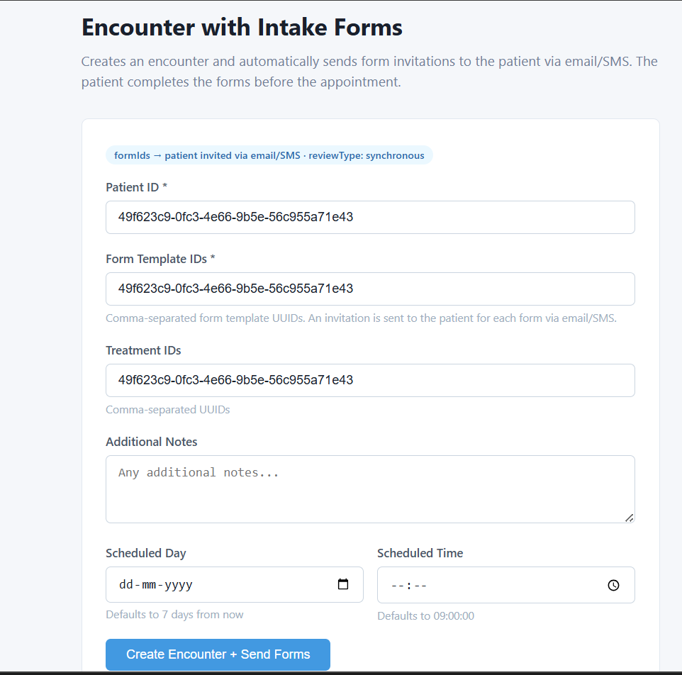

# With Forms Encounter Sample

Demonstrates creating an encounter in Wizlo with intake form invitations sent to the patient, using the Wizlo API.

## What This Sample Demonstrates
- OAuth2 client credentials authentication with Wizlo
- Creating an encounter via `POST /encounters` with `formIds` attached
- Triggering automatic email/SMS intake form invitations to the patient on encounter creation
- NestJS backend with a singleton `WizloService` for authenticated API calls
- Next.js 14 App Router frontend with a form UI

## Prerequisites
- Node.js 18+

## Running the Backend

```bash
cd backend
cp .env.example .env
# Fill in WIZLO_CLIENT_ID and WIZLO_CLIENT_SECRET in .env
npm install
npm run dev
# Runs on http://localhost:3005
```

## Running the Frontend

```bash
cd frontend
npm install
npm run dev
# Runs on http://localhost:3015
```

## API Endpoints

### POST /encounters
Creates an encounter with intake form invitations in Wizlo.

```bash
curl -X POST http://localhost:3005/encounters \
  -H "Content-Type: application/json" \
  -d '{
    "patientId": "49f623c9-0fc3-4e66-9b5e-56c955a71e43",
    "formIds": ["form-uuid-1", "form-uuid-2"],
    "additionalNotes": "Please complete intake forms before your appointment",
    "scheduledDay": "2026-05-20",
    "scheduledTime": "10:00:00"
  }'
```

---

## Step-by-Step: How With-Forms Encounter Creation Works

### Step 1 — Get Your Wizlo API Credentials

Before anything runs, you need M2M (Machine-to-Machine) credentials from Wizlo.

- `WIZLO_CLIENT_ID` — your app's client ID
- `WIZLO_CLIENT_SECRET` — your app's client secret
- `WIZLO_BASE_URL` — API base URL (default: `https://api-uat.wizlo.com`)

Put these in `backend/.env` (copy from `backend/.env.example`):

```env
PORT=3005
WIZLO_BASE_URL=https://api-uat.wizlo.com
WIZLO_CLIENT_ID=your_client_id_here
WIZLO_CLIENT_SECRET=your_client_secret_here
WIZLO_CLINIC_ID=1d836ade-bb7e-47a5-9f4a-d2c45ad8dad6
WIZLO_REVIEWER_ID=3a620f69-fa01-4c3d-b963-f945a91acb3c
WIZLO_PHARMACY_ID=51ddaed0-69d2-4ad2-a474-19d2d90e8ac6
```

> `WIZLO_CLINIC_ID`, `WIZLO_REVIEWER_ID`, and `WIZLO_PHARMACY_ID` are fixed Wizlo resource IDs. Replace them if your environment uses different ones.

---

### Step 2 — Authentication Token Generation (M2M / OAuth2)

When you make the first API call, the backend automatically fetches a token. You do **not** need to do this manually — it happens behind the scenes.

**What happens internally:**

The backend (`backend/src/wizlo/wizlo.service.ts`) sends this request to Wizlo:

```
POST https://api-uat.wizlo.com/oauth/token
Content-Type: application/json

{
  "grant_type": "client_credentials",
  "client_id": "<your client id>",
  "client_secret": "<your client secret>"
}
```

**Token response from Wizlo:**

```json
{
  "access_token": "eyJhbGciOi...",
  "token_type": "Bearer",
  "expires_in": 3600
}
```

The token is cached in memory and automatically attached as a `Bearer` token to every subsequent Wizlo API request. You do not need to manage it.

---

### Step 3 — Fill In the Encounter Form

Open the frontend at `http://localhost:3015`.



Fill in the fields:

**Patient ID** *(required)*
The unique ID of the patient in Wizlo. Must be a UUID.
Example: `49f623c9-0fc3-4e66-9b5e-56c955a71e43`

**Form IDs** *(required)*
UUIDs of the form templates to attach. Wizlo will send email/SMS invitations to the patient for each form. Enter multiple IDs separated by commas.
Example: `form-uuid-1, form-uuid-2`

**Treatment IDs** *(optional)*
Treatments to include in this encounter. Enter multiple IDs separated by commas.
Example: `treatment-1, treatment-2`

**Additional Notes** *(optional)*
Any free-text notes for the reviewer — e.g. `Please complete intake forms before your appointment`.

**Scheduled Day** *(optional)*
The date of the appointment in `YYYY-MM-DD` format — e.g. `2026-05-20`.
If left blank, defaults to **7 days from today**.

**Scheduled Time** *(optional)*
The time of the appointment in `HH:MM` format — e.g. `10:00`.
If left blank, defaults to **09:00 AM**.

---

### Step 4 — What Gets Sent to the Wizlo API

After you click **Create Encounter**, the backend builds a full payload and sends it to Wizlo:

```
POST https://api-uat.wizlo.com/encounters
Authorization: Bearer <access_token>
Content-Type: application/json
```

**Request body:**

```json
{
  "clinicId": "<from WIZLO_CLINIC_ID env>",
  "reviewerId": "<from WIZLO_REVIEWER_ID env>",
  "pharmacyId": "<from WIZLO_PHARMACY_ID env>",
  "patientId": "<from your form input>",
  "scheduledDay": "2026-05-20",
  "scheduledTime": "10:00:00",
  "scheduledTimeZone": "America/Los_Angeles",
  "slotDurationMinutes": 30,
  "additionalNotes": "Please complete intake forms before your appointment",
  "formIds": ["form-uuid-1", "form-uuid-2"],
  "treatmentIds": [],
  "documentIds": [],
  "reviewType": "synchronous",
  "serviceQueue": "internal_staff",
  "source": "FORMS",
  "isCommissionWaived": false,
  "skipOrderCreation": false,
  "isHrtTrtEncounter": false,
  "allowUnassignedOnFailure": true,
  "skipAppointmentCreation": false
}
```

> `formIds` is the only difference from a standard encounter. Passing form UUIDs here instructs Wizlo to automatically send email/SMS invitations to the patient — one per form template — at the time of encounter creation.

---

### Step 5 — Response

On success, the Wizlo API returns the created encounter object. It is displayed on the frontend as formatted JSON.

**Example success response:**

```json
{
  "id": "enc-uuid-here",
  "patientId": "49f623c9-0fc3-4e66-9b5e-56c955a71e43",
  "clinicId": "1d836ade-bb7e-47a5-9f4a-d2c45ad8dad6",
  "scheduledDay": "2026-05-20",
  "scheduledTime": "10:00:00",
  "status": "pending",
  ...
}
```

**On validation error (400):** The backend returns a descriptive error — e.g. if `patientId` or `formIds` is missing.

**On API error:** The error message from Wizlo is forwarded and shown in a red box on the frontend.

---

### Full Request Flow (Summary)

```
Browser (localhost:3015)
  └─ POST /encounters → Backend (localhost:3005)
        └─ Fetches Bearer token from Wizlo (if not cached)
              └─ POST /encounters → Wizlo API (api-uat.wizlo.com)
                    └─ Returns encounter JSON → Backend → Browser
```
