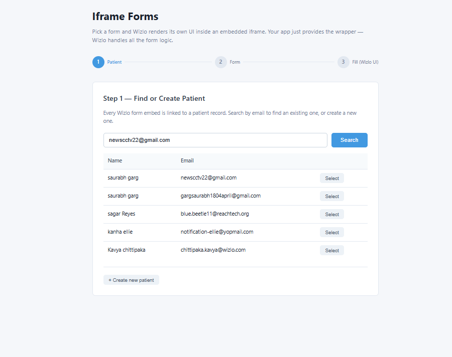
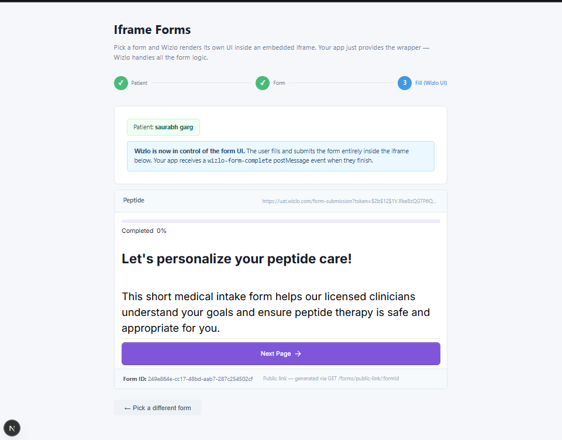
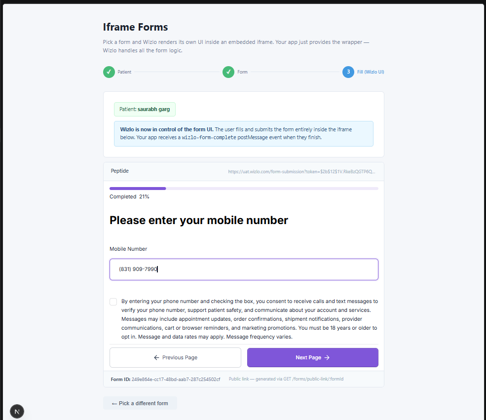

# Wizlo Forms — With Wizlo

Two sample apps showing how to integrate Wizlo forms into your product.

| Sample | Pattern | Who renders the UI? | Backend port | Frontend port |
|---|---|---|---|---|
| [`programmatic/`](./programmatic/) | Your app collects answers → sends JSON to Wizlo | **You** | 3020 | 3021 |
| [`iframe/`](./iframe/) | Wizlo's pre-built UI embedded in an `<iframe>` | **Wizlo** | 3022 | 3023 |

## Quick comparison

```
Programmatic                          Iframe
────────────────────────────────────  ────────────────────────────────────
GET  /forms/:id/schema                GET  /forms
  ↓ fieldSchema[] + payloadTemplate     ↓ form list
Render your own <input> fields        POST /forms/attach
  ↓ user fills in                       ↓ embedUrl
POST /forms/programmatic/submit       <iframe src={embedUrl} />
  ↓ { submissionId, patientUpdated }    ↓ postMessage: wizlo-form-complete
```

See each subfolder's `README.md` for full setup instructions and API reference.

---

## Screenshots

### Programmatic Forms — submission result


### Iframe Forms — Step 1: Find or Create Patient



### Iframe Forms — Step 3: Wizlo form embedded and loaded



### Iframe Forms — Step 3: Form in progress


