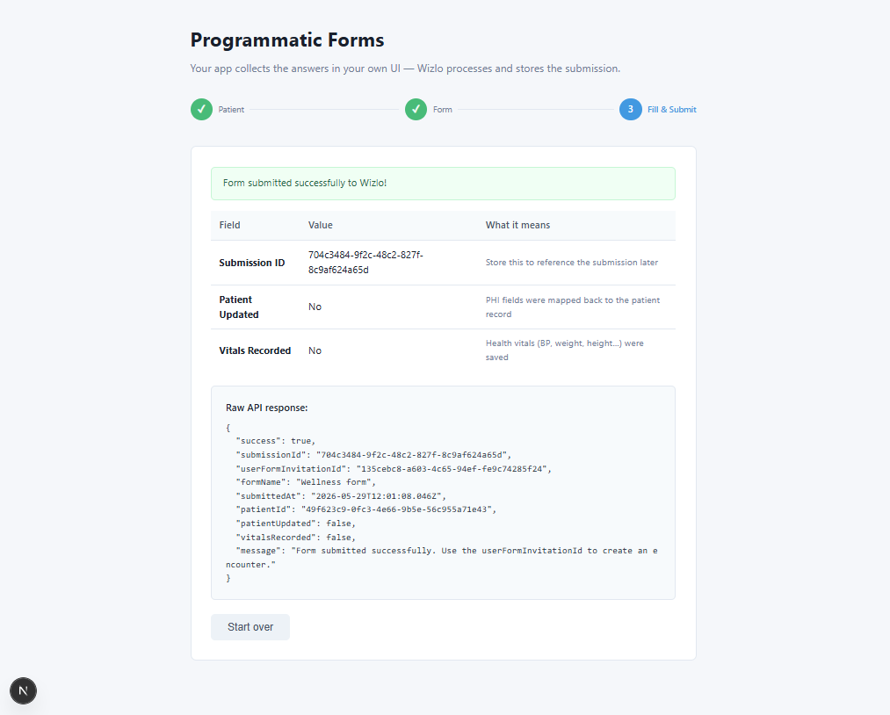

# Wizlo Forms — Programmatic Submission

**Your app provides the UI. Wizlo processes and stores the data.**

In this pattern the user fills in a form rendered by **your own frontend**. When they submit, your backend sends the collected data to the Wizlo API. Wizlo then maps PHI fields back to the patient record, records health vitals, creates a formal submission, and fires any configured webhooks — all without the user ever leaving your interface.

---

## When to use this pattern

| ✅ Use programmatic when… | ❌ Use iframe instead when… |
|---|---|
| You need full UI/UX control and branding | You want zero frontend work |
| You need to pre-fill fields from your own system | You're OK with Wizlo's look and feel |
| You want to validate or transform data before sending | The form is complex (payments, IDV, file uploads) |
| Your form lives inside a native app or SPA | You need Wizlo's built-in draft / resume support |

---

## How it works

```
Step 1 — Patient
  Frontend: user enters email → GET /patients?email=...
  If not found → POST /patients  (create new patient)
  Result: patient.id  ← needed for submission

Step 2 — Select Form
  Frontend: list picker → GET /forms?status=published
  User picks a form → load its field schema:
    GET /forms/:id/schema
  Returns:
    fieldSchema[]     ← flat list: { fieldName, label, dataType, required, isPHI, ... }
    payloadTemplate   ← pages → rows → fields JSON tree with empty values

Step 3 — Fill & Submit
  Frontend renders one <input> per fieldSchema entry
  User fills in values
  On submit:
    1. Clone payloadTemplate
    2. Walk every field in the tree → set field.value = user-entered value
    3. POST /submission/submit  { formId, patientId, structure }
    → Wizlo returns: { success, submissionId, patientUpdated, vitalsRecorded }
```

---

## File structure

```
programmatic/
├── README.md
├── backend/                   NestJS backend (port 3020)
│   ├── .env.example
│   └── src/
│       ├── main.ts            Entry point — CORS + validation pipe
│       ├── app.module.ts      Registers Patients, Forms, Submission modules
│       ├── wizlo/
│       │   └── wizlo.service.ts   OAuth2 token cache + request helper
│       ├── patients/
│       │   ├── patients.controller.ts  GET /patients, POST /patients, PUT /patients/:id
│       │   └── patients.service.ts     Proxies to Wizlo /clients
│       ├── forms/
│       │   ├── forms.controller.ts     GET /forms, GET /forms/:id/schema
│       │   └── forms.service.ts        Lists published forms + fetches field schema
│       └── submission/
│           ├── submission.controller.ts  POST /submission/submit
│           └── submission.service.ts     Calls POST /forms/programmatic/submit
└── frontend/                  Next.js frontend (port 3021)
    └── src/
        ├── lib/api.ts         Typed fetch wrappers for every backend endpoint
        └── app/
            └── page.tsx       3-step form UI with dynamic field rendering
```

---

## Setup

### 1. Backend

```bash
cd backend
cp .env.example .env
```

Edit `.env`:
```env
PORT=3020
WIZLO_BASE_URL=https://api-uat.wizlo.com
WIZLO_CLIENT_ID=your_client_id
WIZLO_CLIENT_SECRET=your_client_secret
```

```bash
npm install
npm run dev
# Backend: http://localhost:3020
```

### 2. Frontend

```bash
cd frontend
cp .env.local.example .env.local
npm install
npm run dev
# Frontend: http://localhost:3021
```

---

## API endpoints (backend)

### Patients

```bash
# Search by email
GET /patients?email=jane@example.com

# Create
POST /patients
{ "firstName": "Jane", "lastName": "Doe", "email": "jane@example.com" }

# Update
PUT /patients/:id
{ "firstName": "Jane" }
```

### Forms

```bash
# List published forms
GET /forms

# Get field schema for a form
# Returns fieldSchema[], structure, and payloadTemplate
GET /forms/:id/schema
```

### Submission

```bash
# Submit filled form to Wizlo
POST /submission/submit
{
  "formId":    "<form-uuid>",
  "patientId": "<patient-uuid>",
  "structure": {
    "pages": [{
      "id": "page_1",
      "rows": [{
        "id": "row_1",
        "fields": [
          { "name": "phi_first_name", "value": "Jane" },
          { "name": "phi_last_name",  "value": "Doe" }
        ]
      }]
    }]
  },
  "metadata": {
    "source": "my-portal",
    "submittedBySystem": "Patient Portal v2"
  }
}
```

**Response:**
```json
{
  "success": true,
  "submissionId": "a1b2c3...",
  "userFormInvitationId": "d4e5f6...",
  "patientUpdated": true,
  "vitalsRecorded": false,
  "formName": "Health Intake",
  "submittedAt": "2025-05-29T10:00:00.000Z"
}
```

| Field | What it means |
|---|---|
| `submissionId` | Store this to reference the submission (GET /forms/submissions/:id) |
| `patientUpdated` | `true` if PHI fields (name, DOB, address…) were written back to the patient |
| `vitalsRecorded` | `true` if health vitals (BP, weight, height…) were saved from the form |

---

## How the structure is built

The `payloadTemplate` from `GET /forms/:id/schema` is the exact JSON you need to fill.
Clone it, walk every field, and set `field.value`:

```typescript
function buildStructure(template: any, values: Record<string, string>) {
  const structure = JSON.parse(JSON.stringify(template));  // deep clone
  for (const page of structure.pages ?? []) {
    for (const row of page.rows ?? []) {
      for (const field of row.fields ?? []) {
        if (field.name && values[field.name] !== undefined) {
          field.value = values[field.name];
        }
      }
    }
  }
  return structure;
}
```

> **PHI fields** (where `isPHI: true` in the schema) are special — Wizlo maps them back to
> the patient record automatically on submission. For example, if your form has a field
> named `phi_first_name` and the value differs from the patient's stored first name,
> Wizlo will update the patient record and set `patientUpdated: true` in the response.

---

## Screenshots

### Step 3 — Successful submission

After filling all form fields and clicking **Submit to Wizlo**, the response is displayed with the submission ID, whether PHI fields were written back to the patient, and whether health vitals were recorded.



---

## Environment variables

| Variable | Required | Description |
|---|---|---|
| `PORT` | No | Backend port (default: 3020) |
| `WIZLO_BASE_URL` | Yes | Wizlo API base URL (e.g. `https://api-uat.wizlo.com`) |
| `WIZLO_CLIENT_ID` | Yes | Your Wizlo M2M client ID |
| `WIZLO_CLIENT_SECRET` | Yes | Your Wizlo M2M client secret |
