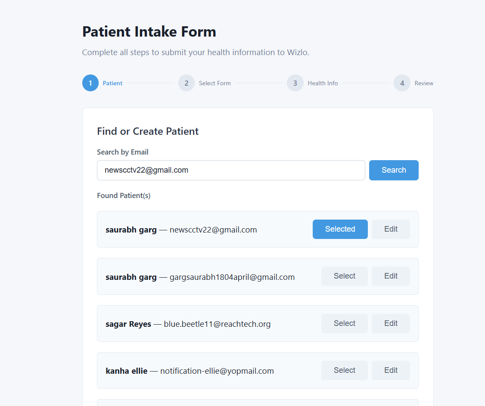
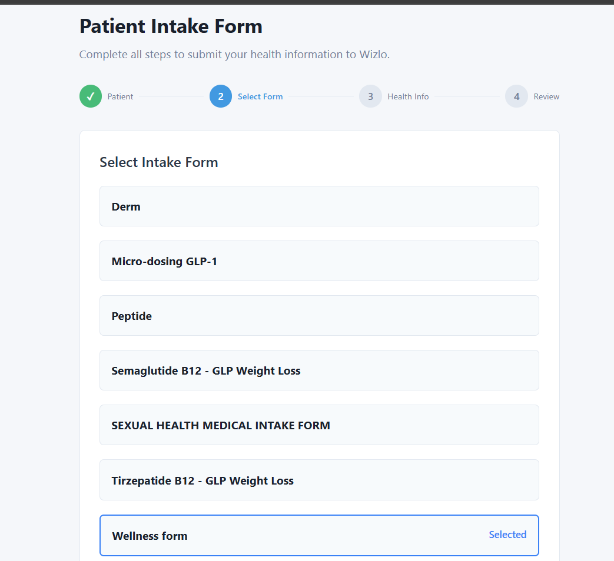
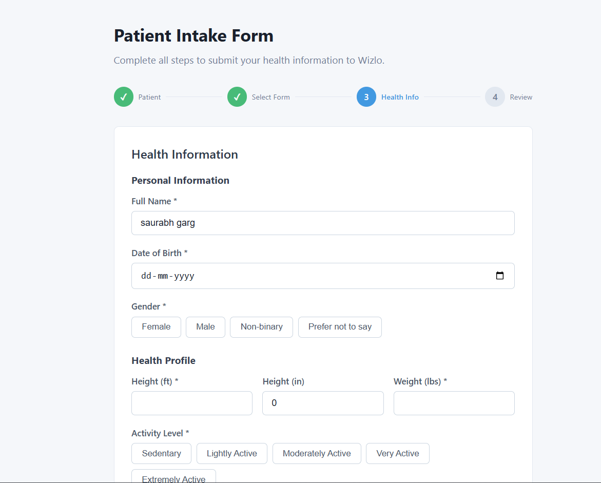
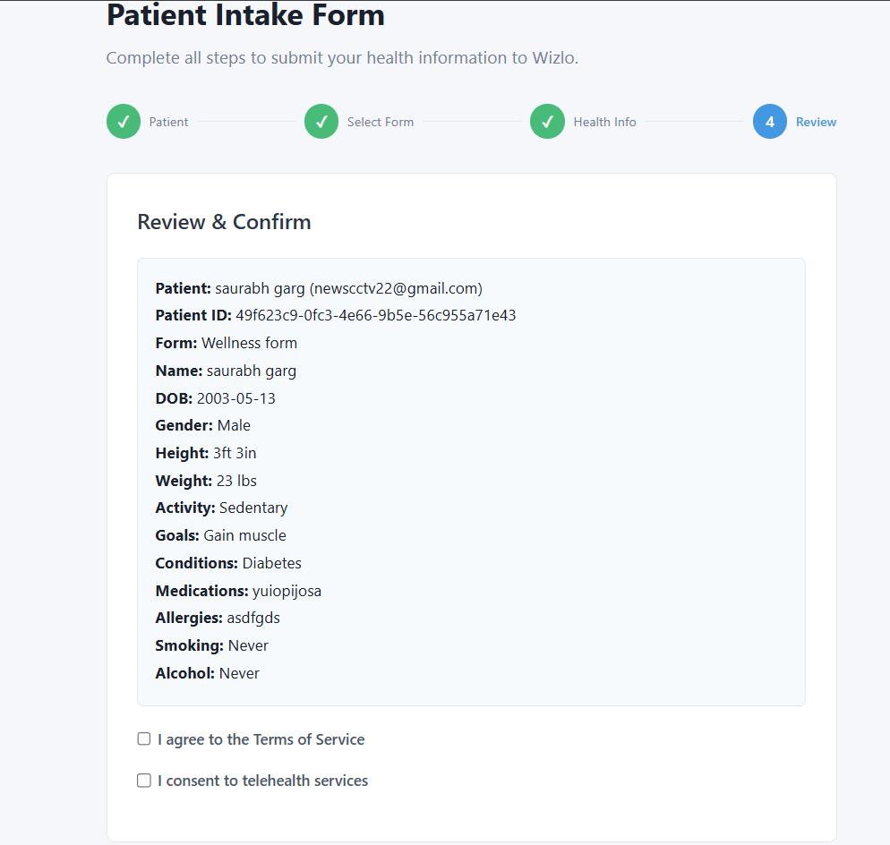
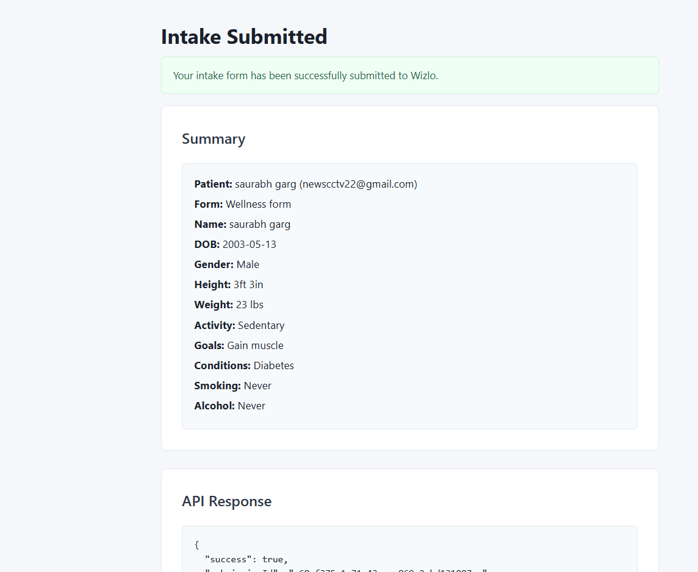

# Wizlo Intake Form — With Wizlo Integration

A 4-step patient intake form that integrates with the Wizlo API end-to-end: search or create a patient, select a published form, fill in health data, and submit programmatically.

---

## Prerequisites

- Node.js 18+
- Wizlo UAT credentials (`WIZLO_CLIENT_ID`, `WIZLO_CLIENT_SECRET`)

---

## Setup

### 1. Backend

```bash
cd backend
cp .env.example .env
```

Open `.env` and fill in your credentials:

```env
PORT=3003
WIZLO_BASE_URL=https://api-uat.wizlo.com
WIZLO_CLIENT_ID=your_client_id
WIZLO_CLIENT_SECRET=your_client_secret
```

Then run:

```bash
npm install
npm run dev
# Backend running at http://localhost:3003
```

### 2. Frontend

```bash
cd frontend
cp .env.local.example .env.local
npm install
npm run dev
# Frontend running at http://localhost:3013
```

---

## How It Works

This sample maps directly to the Wizlo API curl sequence:

| Step | API Call | Description |
|------|----------|-------------|
| Auth | `POST /oauth/token` | OAuth2 token fetched automatically by `WizloService` |
| 1 | `GET /clients?email=` | Search existing patients by email |
| 1 | `POST /clients` | Create a new patient if not found |
| 1 | `PUT /clients/:id` | Optionally edit an existing patient |
| 2 | `GET /forms?status=published` | Fetch list of published forms |
| 2 | `GET /forms/:id` | View detail of the selected form |
| 3 | Fill health info | Personal info, health profile, medical history |
| 4 | `POST /forms/programmatic/submit` | Submit the completed form |

---

## Step-by-Step Flow

### Step 1 — Find or Create Patient

Search for a patient by email. If found, select them or click **Edit** to update their details. If not found, fill in the create form and click **Create Patient**.



---

### Step 2 — Select Intake Form

All published forms are loaded from Wizlo. Click any form to view its details, then select the one you want to submit.



---

### Step 3 — Fill Health Information

Fill in the patient's personal information, health profile (height, weight, activity level, goals), and medical history (conditions, medications, allergies, smoking, alcohol).



---

### Step 4 — Review & Submit

Review all collected data including the resolved Patient ID. Check both consent boxes and click **Submit Intake Form**.



---

### Success

On successful submission the page shows a summary and the raw Wizlo API response (`"success": true`).



---

## API Endpoints

All endpoints are proxied through the local backend which handles Wizlo authentication automatically.

### Search patients by email
```bash
curl "http://localhost:3003/patients?email=patient@example.com"
```

### Create a patient
```bash
curl -X POST http://localhost:3003/patients \
  -H "Content-Type: application/json" \
  -d '{"firstName":"Jane","lastName":"Doe","email":"jane@example.com"}'
```

### Update a patient
```bash
curl -X PUT http://localhost:3003/patients/<PATIENT_ID> \
  -H "Content-Type: application/json" \
  -d '{"firstName":"Jane","lastName":"Smith"}'
```

### List published forms
```bash
curl http://localhost:3003/forms
```

### Get form detail
```bash
curl http://localhost:3003/forms/<FORM_ID>
```

### Get form schema
```bash
curl http://localhost:3003/forms/<FORM_ID>/schema
```

### Submit intake form
```bash
curl -X POST http://localhost:3003/intake/submit \
  -H "Content-Type: application/json" \
  -d '{
    "formId": "<FORM_ID>",
    "patientId": "<PATIENT_ID>",
    "structure": {
      "pages": [{
        "id": "page_intake",
        "rows": [
          { "id": "row_1", "order": 0, "fields": [{ "name": "full_name", "label": "Full Name", "value": "Jane Doe" }] }
        ]
      }]
    }
  }'
```
