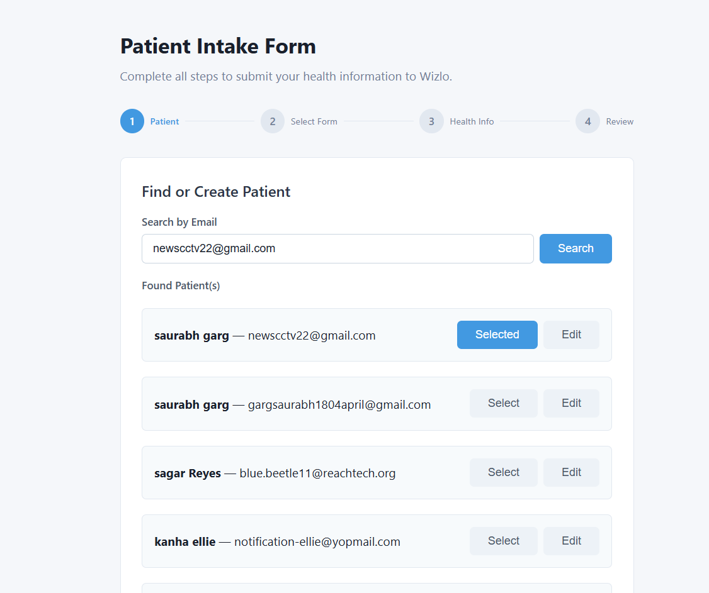
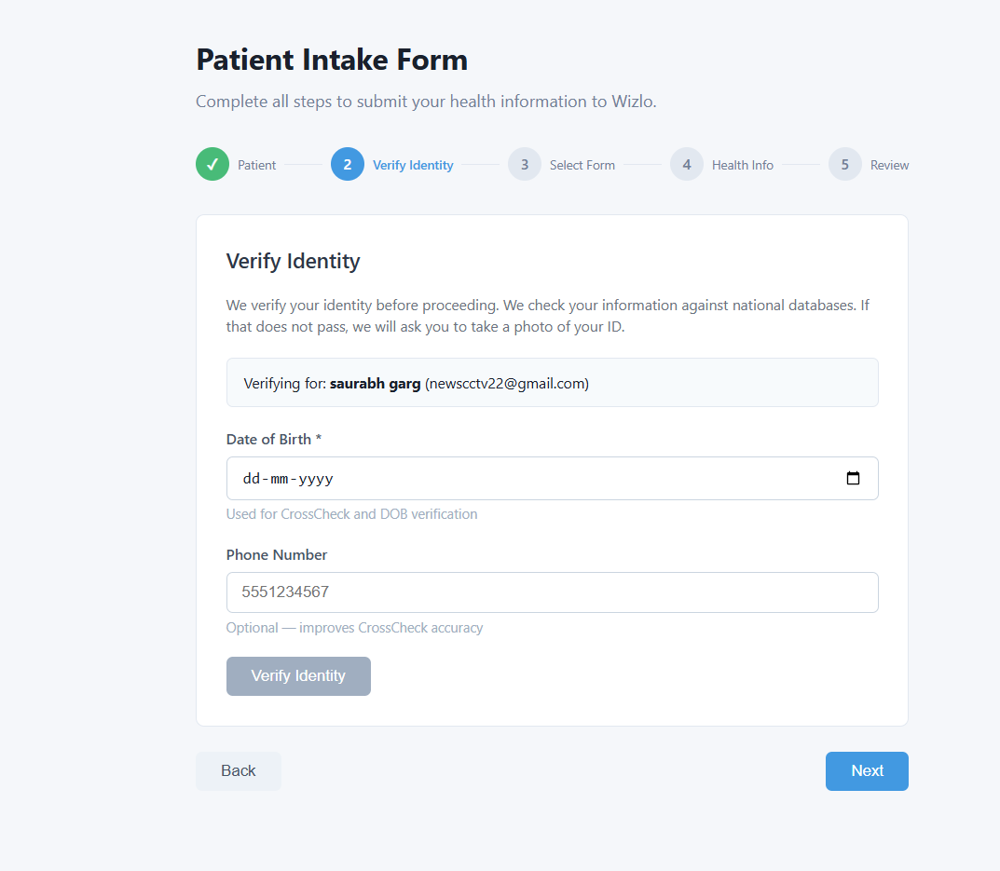
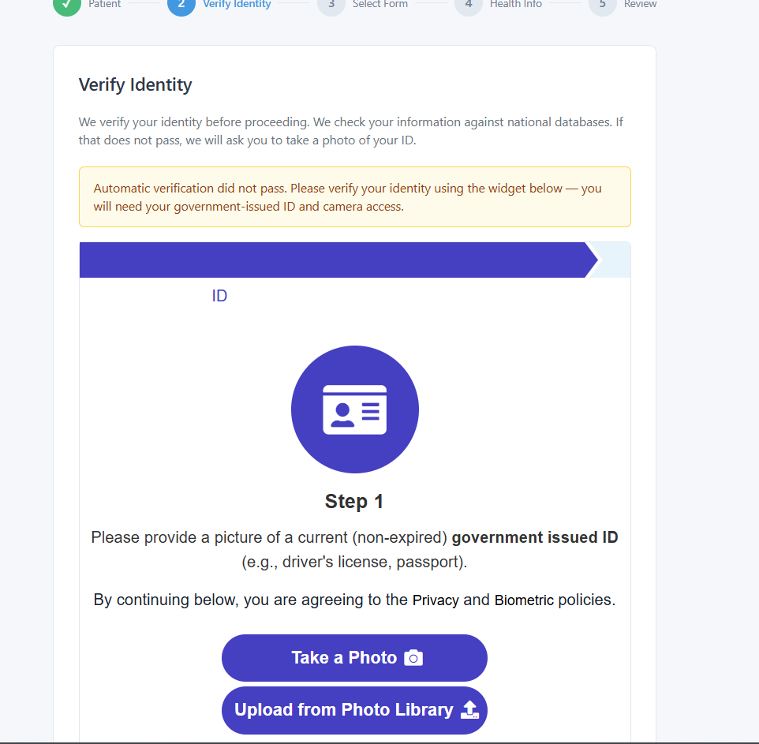
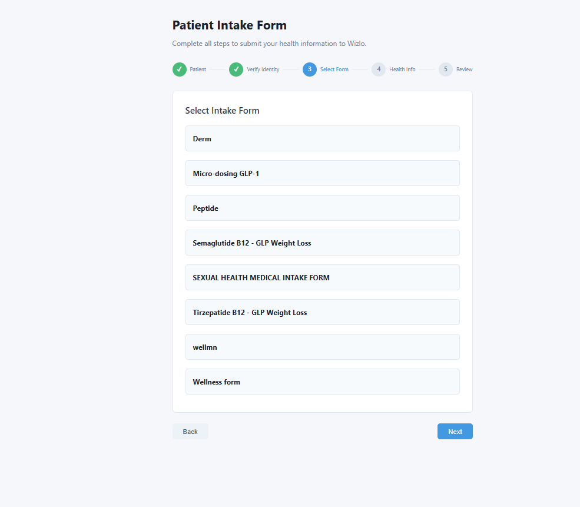
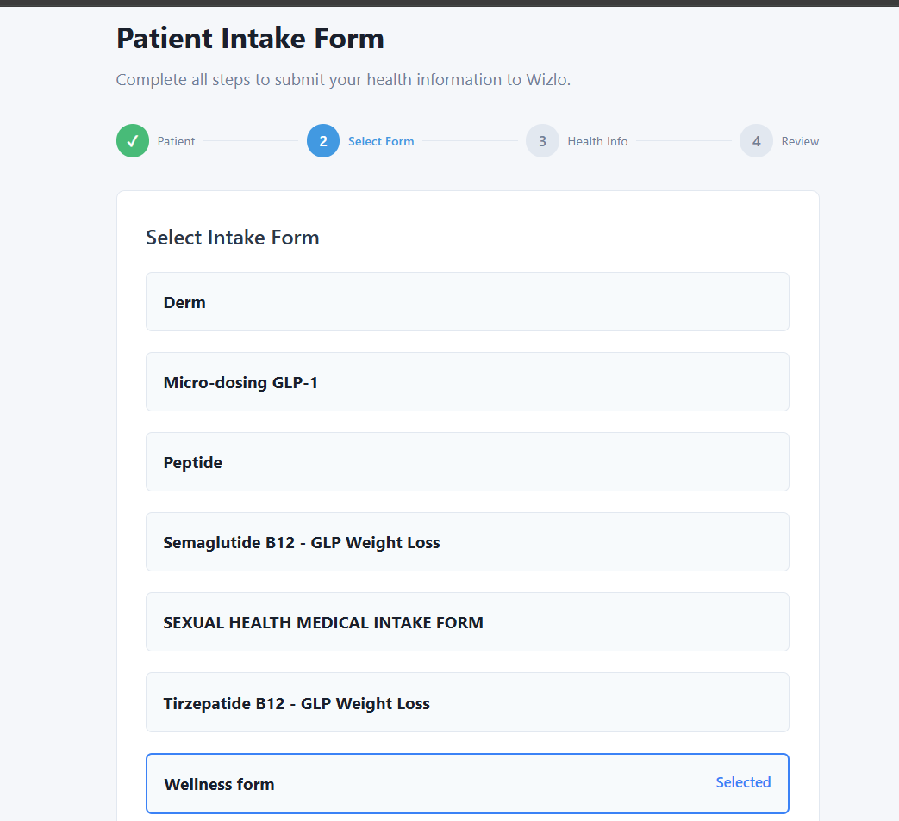
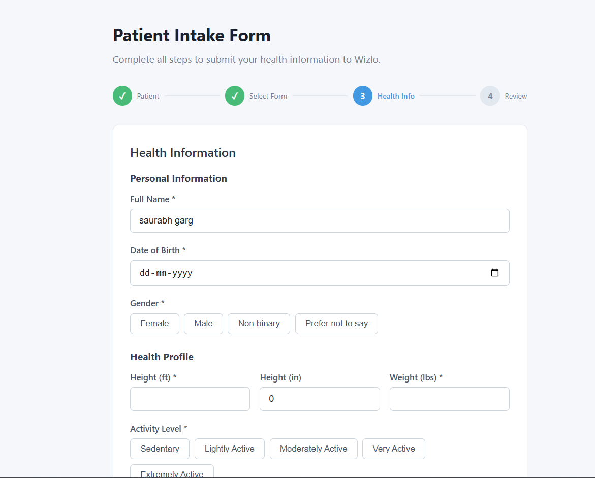
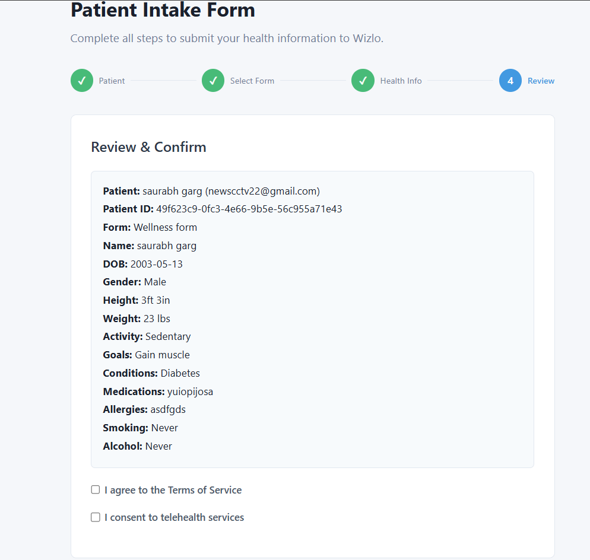
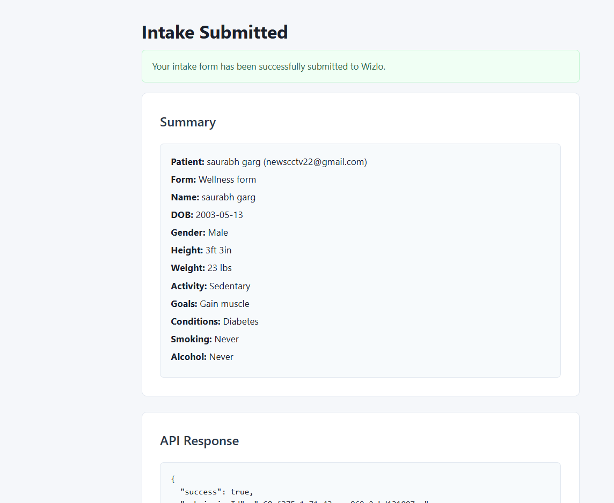

# Wizlo Intake Form — With Wizlo + Vouched Identity Verification

A 5-step patient intake form that integrates with the Wizlo API end-to-end: search or create a patient, verify their identity with [Vouched](https://vouched.id), select a published form, fill in health data, and submit programmatically.

---

## Prerequisites

- Node.js 18+
- Wizlo UAT credentials (`WIZLO_CLIENT_ID`, `WIZLO_CLIENT_SECRET`)
- Vouched API keys (`VOUCHED_PUBLIC_KEY`, `VOUCHED_PRIVATE_KEY`)
- For webhook testing: a public URL (e.g. via [ngrok](https://ngrok.com))

---

## Setup

### 1. Backend

```bash
cd backend
cp .env.example .env
```

Open `.env` and fill in your credentials:

```env
PORT=3003
WIZLO_BASE_URL=https://api-uat.wizlo.com
WIZLO_CLIENT_ID=your_client_id
WIZLO_CLIENT_SECRET=your_client_secret

# Vouched identity verification
VOUCHED_PUBLIC_KEY=your_vouched_public_key
VOUCHED_PRIVATE_KEY=your_vouched_private_key
VOUCHED_API_URL=https://verify.vouched.id/api/invites
VOUCHED_CALLBACK_URL=https://your-ngrok-or-domain/forms/public/vouched-webhook
VOUCHED_JOB_API_URL=https://verify.vouched.id/api/jobs
VOUCHED_CROSSCHECK_API_URL=https://verify.vouched.id/api/identity/crosscheck
VOUCHED_DOB_VERIFY_API_URL=https://verify.vouched.id/api/dob/verify

# Set to true to bypass the IDV camera widget in local development
VOUCHED_SKIP_IDV=true
```

Then run:

```bash
npm install
npm run dev
# Backend running at http://localhost:3003
```

### 2. Frontend

```bash
cd frontend
cp .env.local.example .env.local
npm install
npm run dev
# Frontend running at http://localhost:3013
```

---

## How It Works

| Step | API Call | Description |
|------|----------|-------------|
| Auth | `POST /oauth/token` | OAuth2 token fetched and cached automatically by `WizloService` |
| 1 | `GET /clients?email=` | Search existing patients by email |
| 1 | `POST /clients` | Create a new patient if not found |
| 1 | `PUT /clients/:id` | Optionally edit an existing patient |
| 2 | `POST /forms/public/check-prior-verification` | Skip IDV if patient is already verified |
| 2 | `POST /forms/public/vouched-verify` | CrossCheck → DOB fallback → IDV widget |
| 2 | `POST /forms/public/vouched-idv-result` | Fetch and store the IDV widget result |
| 3 | `GET /forms?status=published` | Fetch list of published intake form templates |
| 3 | `GET /forms/:id` | View detail of the selected form |
| 4 | Fill health info | Personal info, health profile, medical history |
| 5 | `POST /forms/programmatic/submit` | Submit the completed form to Wizlo |

---

## Step-by-Step Flow

### Step 1 — Find or Create Patient

Search for a patient by email. If found, select them or click **Edit** to update their details. If not found, fill in the create form and click **Create Patient**.



---

### Step 2 — Verify Identity

Identity verification runs automatically as soon as the patient is selected. The backend tries three methods in order:

```
POST /forms/public/vouched-verify
        │
        ├─ 1. CrossCheck  (name + phone + email vs. national databases)
        │     matchRate ≥ 85%  →  verified ✓  (proceeds to Step 3)
        │
        ├─ 2. DOB Verify  (name + phone + date-of-birth)
        │     dobMatch = true  →  verified ✓  (proceeds to Step 3)
        │
        └─ 3. IDV Widget  (camera — government-issued ID + selfie)
              POST /forms/public/vouched-idv-result  →  verified ✓
```

#### Step 2a — Automatic verification form

The patient enters their date of birth and optionally their phone number. The backend runs CrossCheck and DOB verify silently.



#### Step 2b — IDV widget fallback

If both automatic checks fail, the Vouched camera widget appears. The patient photographs a government-issued ID (driver's license or passport).



#### Step 2c — Verified

Once any method succeeds, the verification result is persisted to the Wizlo patient record and the form advances automatically.



---

### Step 3 — Select Intake Form

All published forms are loaded from Wizlo. Click any form to view its details, then select the one you want to submit.



---

### Step 4 — Fill Health Information

Fill in the patient's personal information, health profile (height, weight, activity level, goals), and medical history (conditions, medications, allergies, smoking, alcohol).



---

### Step 5 — Review & Submit

Review all collected data including the resolved Patient ID. Check both consent boxes and click **Submit Intake Form**.



---

### Success

On successful submission the page shows a summary and the raw Wizlo API response (`"success": true`).



---

## Environment Variables

### Backend (`.env`)

| Variable | Required | Description |
|----------|----------|-------------|
| `PORT` | No | Backend port (default: `3003`) |
| `WIZLO_BASE_URL` | Yes | Wizlo API base URL |
| `WIZLO_CLIENT_ID` | Yes | Your Wizlo OAuth2 client ID |
| `WIZLO_CLIENT_SECRET` | Yes | Your Wizlo OAuth2 client secret |
| `VOUCHED_PUBLIC_KEY` | Yes | Vouched public key — returned to the frontend to initialise the JS SDK |
| `VOUCHED_PRIVATE_KEY` | Yes | Vouched private key — used for server-side API calls and webhook HMAC signing |
| `VOUCHED_API_URL` | Yes | Vouched invites API URL |
| `VOUCHED_CALLBACK_URL` | Yes | Public URL that Vouched POSTs webhook events to |
| `VOUCHED_JOB_API_URL` | Yes | Vouched jobs API URL |
| `VOUCHED_CROSSCHECK_API_URL` | Yes | Vouched CrossCheck API URL |
| `VOUCHED_DOB_VERIFY_API_URL` | Yes | Vouched DOB verification API URL |
| `VOUCHED_SKIP_IDV` | No | Set `true` to skip the IDV camera widget in local development |

### Frontend (`.env.local`)

| Variable | Description |
|----------|-------------|
| `NEXT_PUBLIC_API_URL` | Backend URL (default: `http://localhost:3003`) |

---

## API Endpoints

All endpoints are proxied through the local backend which handles Wizlo and Vouched authentication automatically.

### Patients

```bash
# Search patients by email
curl "http://localhost:3003/patients?email=patient@example.com"

# Create a patient
curl -X POST http://localhost:3003/patients \
  -H "Content-Type: application/json" \
  -d '{"firstName":"Jane","lastName":"Doe","email":"jane@example.com"}'

# Update a patient
curl -X PUT http://localhost:3003/patients/<PATIENT_ID> \
  -H "Content-Type: application/json" \
  -d '{"firstName":"Jane","lastName":"Smith"}'
```

### Identity Verification (Vouched)

```bash
# Get Vouched public key for the frontend SDK
curl http://localhost:3003/forms/public/vouched-public-config

# Check if the patient is already verified (skip IDV)
curl -X POST http://localhost:3003/forms/public/check-prior-verification \
  -H "Content-Type: application/json" \
  -d '{"patientId":"<PATIENT_ID>"}'

# Run CrossCheck + DOB verify
curl -X POST http://localhost:3003/forms/public/vouched-verify \
  -H "Content-Type: application/json" \
  -d '{
    "patientId": "<PATIENT_ID>",
    "firstName": "Jane",
    "lastName": "Doe",
    "dob": "1990-05-15",
    "phone": "5551234567",
    "email": "jane@example.com"
  }'

# Save IDV widget result (called after the Vouched widget completes)
curl -X POST http://localhost:3003/forms/public/vouched-idv-result \
  -H "Content-Type: application/json" \
  -d '{"patientId":"<PATIENT_ID>","token":"<VOUCHED_TOKEN>","jobId":"<VOUCHED_JOB_ID>"}'
```

### Forms

```bash
# List published forms
curl http://localhost:3003/forms

# Get form detail
curl http://localhost:3003/forms/<FORM_ID>

# Get form schema
curl http://localhost:3003/forms/<FORM_ID>/schema
```

### Submit intake form

```bash
curl -X POST http://localhost:3003/intake/submit \
  -H "Content-Type: application/json" \
  -d '{
    "formId": "<FORM_ID>",
    "patientId": "<PATIENT_ID>",
    "structure": {
      "pages": [{
        "id": "page_intake",
        "rows": [
          { "id": "row_1", "order": 0, "fields": [{ "name": "full_name", "label": "Full Name", "value": "Jane Doe" }] }
        ]
      }]
    }
  }'
```

---

## Webhook Setup (optional)

Vouched can POST real-time job status updates to your backend. To receive them locally:

1. Start [ngrok](https://ngrok.com): `ngrok http 3003`
2. Set `VOUCHED_CALLBACK_URL=https://<your-ngrok-id>.ngrok.io/forms/public/vouched-webhook` in `.env`
3. Restart the backend

The backend validates every incoming webhook with an HMAC-SHA1 signature derived from `VOUCHED_PRIVATE_KEY` before processing the payload.
