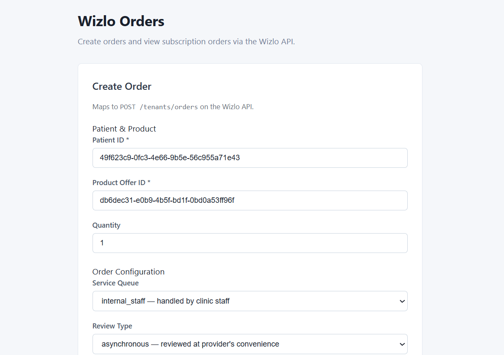
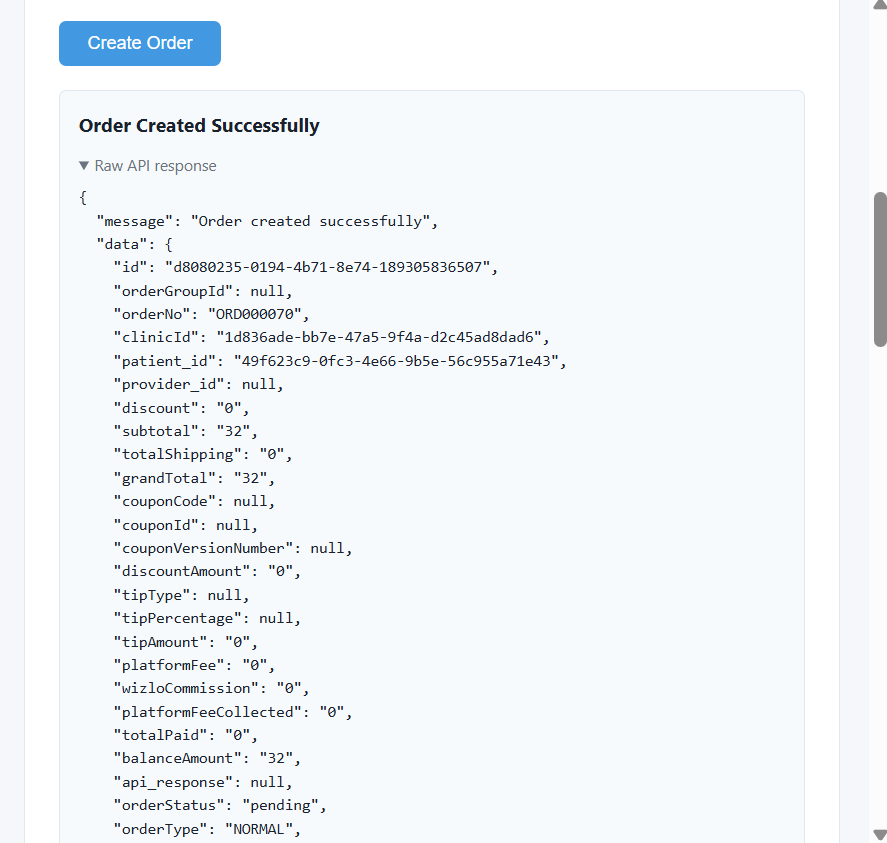

# Wizlo Orders Sample

Demonstrates creating patient orders and viewing subscription orders via the Wizlo API.

---

## Prerequisites

- Node.js 18+
- Wizlo UAT credentials (`WIZLO_CLIENT_ID`, `WIZLO_CLIENT_SECRET`, `WIZLO_CLINIC_ID`)

---

## Setup

### 1. Backend

```bash
cd backend
cp .env.example .env
```

Open `.env` and fill in your credentials:

```env
PORT=3002
WIZLO_BASE_URL=https://api-uat.wizlo.com
WIZLO_CLIENT_ID=your_client_id
WIZLO_CLIENT_SECRET=your_client_secret
WIZLO_CLINIC_ID=your_clinic_id
```

Then run:

```bash
npm install
npm run dev
# Backend running at http://localhost:3002
```

### 2. Frontend

```bash
cd frontend
cp .env.local.example .env.local
npm install
npm run dev
# Frontend running at http://localhost:3012
```

---

## How It Works

| API Call | Description |
|----------|-------------|
| `POST /oauth/token` | OAuth2 token fetched automatically by `WizloService` |
| `POST /tenants/orders` | Create a new order for a patient |
| `GET /subscriptions/:id/orders` | List all orders under a subscription |

---

## Step-by-Step Flow

### Step 1 — Fill Order Details

Enter the Patient ID, Product Offer ID, and Quantity. Then configure the order options:

- **Service Queue** — who handles the order (`internal_staff` or `provider_network`)
- **Review Type** — how the order is reviewed (`asynchronous` or `synchronous`)
- **Source** — where the order originated (`CLINIC` or `FORMS`)

Click **Create Order** to submit.



---

### Step 2 — Order Created Successfully

On success, the page shows a confirmation with the order ID and a collapsible raw API response from Wizlo.



---

## Order Configuration Fields

| Field | Options | Default | Description |
|-------|---------|---------|-------------|
| `serviceQueue` | `internal_staff`, `provider_network` | `internal_staff` | Who handles the order |
| `reviewType` | `asynchronous`, `synchronous` | `asynchronous` | How the order is reviewed |
| `source` | `CLINIC`, `FORMS` | `CLINIC` | Where the order originated |

---

## API Endpoints

### Create an order

```bash
curl -X POST http://localhost:3002/orders \
  -H "Content-Type: application/json" \
  -d '{
    "patientId": "49f623c9-0fc3-4e66-9b5e-56c955a71e43",
    "productOfferId": "db6dec31-e0b9-4b5f-bd1f-0bd0a53ff96f",
    "qty": 2,
    "serviceQueue": "internal_staff",
    "reviewType": "asynchronous",
    "source": "CLINIC"
  }'
```

### Get orders for a subscription

```bash
curl http://localhost:3002/orders/subscription/<SUBSCRIPTION_ID>
```

---

## Wizlo API Mapping

The backend forwards the following payload to Wizlo's `POST /tenants/orders`:

```json
{
  "clinicId": "<from WIZLO_CLINIC_ID env>",
  "patient_id": "<patientId>",
  "items": [{ "productOfferId": "<productOfferId>", "qty": 2 }],
  "serviceQueue": "internal_staff",
  "reviewType": "asynchronous",
  "source": "CLINIC"
}
```
