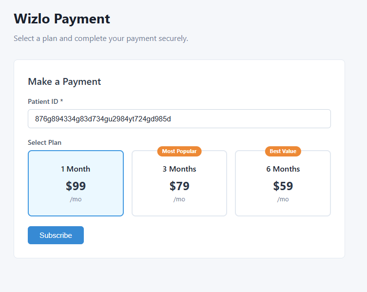
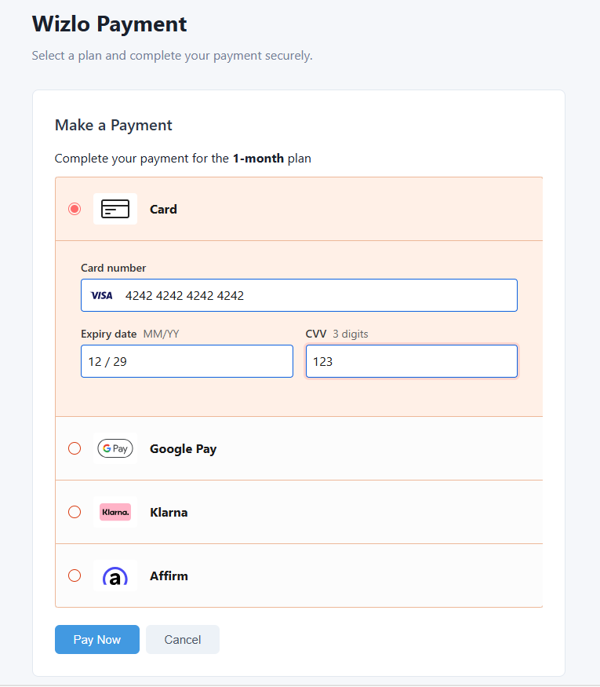
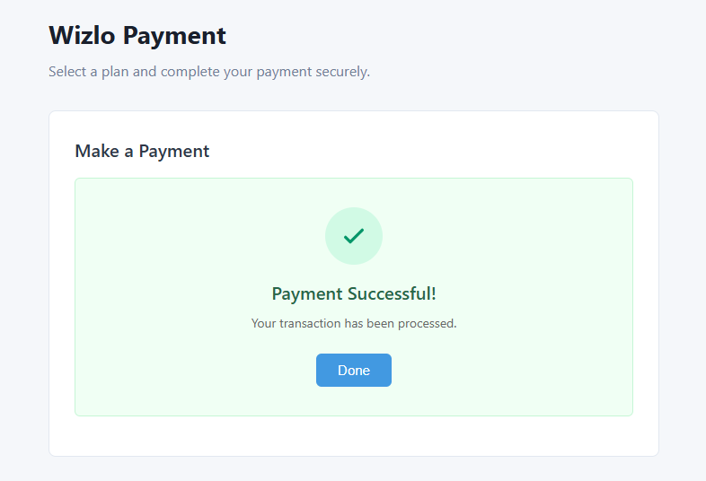

# Wizlo Payment Sample

Demonstrates a plan-based payment flow using **Gr4vy** as the payment orchestration layer.

## What This Sample Demonstrates

- Gr4vy embed token generation from a NestJS backend
- Gr4vy Embed React for PCI-compliant, client-side payment collection (Card, Google Pay, Klarna, Affirm)
- Plan selection UI (1-month, 3-month, 6-month)
- Next.js 14 App Router frontend wired to a NestJS backend

## Prerequisites

- Node.js 18+
- A Gr4vy account with a sandbox `gr4vyId`, private key, and merchant account ID

## Running the Backend

```bash
cd backend
cp .env.example .env
# Fill in all variables in .env
npm install
npm run dev
# Runs on http://localhost:3005
```

## Running the Frontend

```bash
cd frontend
cp .env.local.example .env.local
npm install
npm run dev
# Runs on http://localhost:3015
```

---

## API Endpoint

### `POST /payments/token`

Generates a short-lived Gr4vy embed token scoped to the buyer and payment amount.

```bash
curl -X POST http://localhost:3005/payments/token \
  -H "Content-Type: application/json" \
  -d '{
    "amount": 9900,
    "currency": "USD",
    "buyerExternalIdentifier": "patient-uuid-here"
  }'
```

Response:

```json
{ "token": "<gr4vy-embed-token>" }
```

---

## Step-by-Step: How the Payment Flow Works

### Step 1 — Configure Your Credentials

#### Backend — `backend/.env`
> Copy from `backend/.env.example`

```env
PORT=3005

# Wizlo API
WIZLO_BASE_URL=https://api-uat.wizlo.com
WIZLO_CLIENT_ID=your_wizlo_client_id
WIZLO_CLIENT_SECRET=your_wizlo_client_secret

# Gr4vy
GR4VY_ID=your_gr4vy_id
GR4VY_ENVIRONMENT=sandbox
GR4VY_PRIVATE_KEY_BASE64=<base64-encoded-private-key>
GR4VY_MERCHANT_ACCOUNT_ID=your_merchant_account_id
```

#### Frontend — `frontend/.env.local`
> Copy from `frontend/.env.local.example`

```env
# Backend URL
NEXT_PUBLIC_API_URL=http://localhost:3005

# Gr4vy (public — safe to expose in browser)
NEXT_PUBLIC_GR4VY_ID=your_gr4vy_id
NEXT_PUBLIC_GR4VY_ENVIRONMENT=sandbox
NEXT_PUBLIC_STRIPE_CONNECTED_ACCOUNT_ID=your_stripe_connected_account_id
```

> **Note:** `GR4VY_PRIVATE_KEY_BASE64` (backend only) is your Gr4vy PEM private key encoded as Base64.
> Generate it with: `base64 -w 0 private_key.pem`

---

### Step 2 — Select a Plan

Open the frontend at [http://localhost:3015](http://localhost:3015).



**Patient ID** *(required)*
The unique ID of the patient in Wizlo. Must be a valid identifier.
Example: `49f623c9-0fc3-4e66-9b5e-56c955a71e43`

**Select Plan** *(required)*
Pick one of the 3 pricing tiers:

| Plan | Price | |
|------|-------|-|
| 1 Month | **$99 /mo** | — |
| 3 Months | **$79 /mo** | Most Popular |
| 6 Months | **$59 /mo** | Best Value |

Click **Subscribe** to proceed to payment.

---

### Step 3 — Backend Generates a Gr4vy Embed Token

The frontend calls `POST /payments/token`. The backend:

1. Initializes a Gr4vy SDK client using `GR4VY_ID` and `GR4VY_PRIVATE_KEY_BASE64`
2. Checks if a Gr4vy buyer already exists for the patient ID — creates one if not
3. Calls `client.getEmbedToken(...)` and returns the token:

```ts
const token = await client.getEmbedToken({
  amount: 9900,
  currency: 'USD',
  merchantAccountId: 'merchant-47a04580',
  buyerExternalIdentifier: 'patient-uuid-here',
});
```

---

### Step 4 — Complete Payment via Gr4vy Embed

The frontend renders the Gr4vy Embed component — a hosted, PCI-compliant payment form.



**Supported payment methods:**

- **Card** (via Stripe Connect)
- **Google Pay**
- **Klarna**
- **Affirm**

The patient clicks **Pay Now** to submit. Gr4vy processes the charge directly.

---

### Step 5 — Success

On completion, Gr4vy fires `onComplete` with the transaction object. The frontend shows the **Payment Successful!** screen.



```json
{
  "id": "txn-uuid-here",
  "status": "capture_succeeded",
  "amount": 9900,
  "currency": "USD",
  "paymentMethod": { "method": "card", "scheme": "visa" }
}
```

---

## Full Request Flow

```
Browser (localhost:3015)
  │
  ├─ POST /payments/token → Backend (localhost:3005)
  │       └─ Checks/creates Gr4vy buyer
  │             └─ Fetches embed token ← Gr4vy API
  │                   └─ Returns { token } → Browser
  │
  └─ Gr4vy Embed (rendered in browser, hosted by Gr4vy)
          └─ Patient submits payment → Gr4vy processes charge
                └─ onComplete fires → Frontend shows success
```
