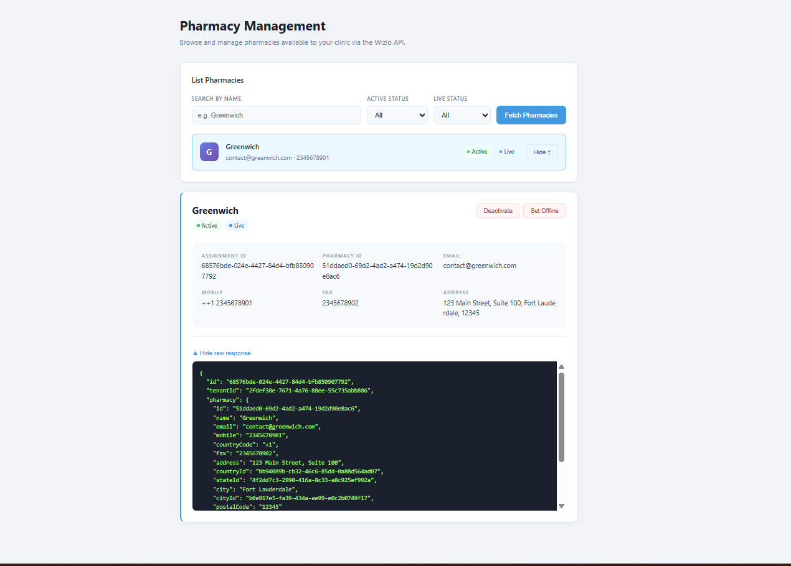

# Pharmacies Sample

Demonstrates how to use the Wizlo Pharmacy APIs to list, view, and manage pharmacies assigned to your clinic.

## APIs Covered

| Method | Endpoint | Description |
|--------|----------|-------------|
| `GET` | `/tenants/pharmacies` | List all pharmacies for your clinic with optional filters |
| `GET` | `/tenants/pharmacies/:id` | Get full details for a specific pharmacy |
| `PATCH` | `/tenants/pharmacies/:id/status` | Activate or deactivate a pharmacy |
| `PATCH` | `/tenants/pharmacies/:id/live` | Toggle a pharmacy's live/offline status |

## Running Locally

### Prerequisites
- Node.js 18+
- Wizlo API credentials (Client ID + Client Secret)

### Backend

```bash
cd backend
cp .env.example .env
# Fill in your credentials in .env
npm install
npm run dev
# Runs on http://localhost:3007
```

### Frontend

```bash
cd frontend
cp .env.local.example .env.local
npm install
npm run dev
# Runs on http://localhost:3017
```

## Project Structure

```
pharmacies/
├── backend/
│   ├── src/
│   │   ├── main.ts                          # NestJS bootstrap (port 3007)
│   │   ├── app.module.ts                    # Root module
│   │   ├── wizlo/
│   │   │   ├── wizlo.service.ts             # OAuth2 token + HTTP wrapper
│   │   │   └── wizlo.module.ts
│   │   └── pharmacies/
│   │       ├── pharmacies.controller.ts     # Route handlers
│   │       ├── pharmacies.service.ts        # Wizlo API calls
│   │       ├── pharmacies.module.ts
│   │       └── dto/
│   │           ├── list-pharmacies.dto.ts
│   │           ├── update-pharmacy-status.dto.ts
│   │           └── update-pharmacy-live.dto.ts
│   ├── .env.example
│   ├── package.json
│   └── tsconfig.json
└── frontend/
    ├── src/
    │   ├── app/
    │   │   ├── layout.tsx
    │   │   ├── globals.css
    │   │   └── page.tsx                     # Main pharmacy management UI
    │   └── lib/
    │       └── api.ts                       # Typed fetch wrappers
    ├── .env.local.example
    └── package.json
```

## Environment Variables

### Backend (`.env`)

| Variable | Description |
|----------|-------------|
| `PORT` | Backend port (default: `3007`) |
| `WIZLO_BASE_URL` | Wizlo API base URL (e.g. `https://api-uat.wizlo.com`) |
| `WIZLO_CLIENT_ID` | Your OAuth2 client ID |
| `WIZLO_CLIENT_SECRET` | Your OAuth2 client secret |

### Frontend (`.env.local`)

| Variable | Description |
|----------|-------------|
| `NEXT_PUBLIC_API_URL` | Backend URL (default: `http://localhost:3007`) |

## API Reference

### List Pharmacies
```bash
GET /pharmacies?search=MedRx&isActive=true&isLive=true&page=1&limit=20
```

Query parameters:

| Parameter | Type | Description |
|-----------|------|-------------|
| `search` | string | Filter by pharmacy name |
| `isActive` | boolean | Filter by active status |
| `isLive` | boolean | Filter by live status |
| `page` | number | Page number (default: 1) |
| `limit` | number | Results per page (default: 20) |

### Get Pharmacy
```bash
GET /pharmacies/:id
```

### Update Pharmacy Status
```bash
PATCH /pharmacies/:id/status
Content-Type: application/json

{ "isActive": false }
```

### Update Pharmacy Live
```bash
PATCH /pharmacies/:id/live
Content-Type: application/json

{ "isLive": true }
```

## Using the UI

Once both servers are running, open [http://localhost:3017](http://localhost:3017) in your browser.



### Step 1 — Search and filter pharmacies

In the **List Pharmacies** section at the top:

1. *(Optional)* Type a pharmacy name in the **Search by Name** field (e.g. `Greenwich`).
2. *(Optional)* Use the **Active Status** dropdown to filter by `Active`, `Inactive`, or `All`.
3. *(Optional)* Use the **Live Status** dropdown to filter by `Live`, `Offline`, or `All`.
4. Click **Fetch Pharmacies** — matching pharmacies appear as cards below the filters.

### Step 2 — View pharmacy details

1. Locate the pharmacy card in the results list. Each card shows the pharmacy name, email, phone number, and its current **Active** / **Live** status badges.
2. Click the card (or the expand toggle) to reveal the full details panel beneath it.
3. The details panel displays:
   - **Assignment ID** and **Pharmacy ID**
   - **Email**, **Mobile**, and **Fax**
   - **Address**
   - A collapsible **raw JSON response** (click *Hide raw response* / *Show raw response* to toggle).

### Step 3 — Change active status

In the open details panel, click **Deactivate** (or **Activate** if the pharmacy is currently inactive) to toggle the pharmacy's active status. The status badge on the card updates immediately without a page reload.

### Step 4 — Change live status

In the same details panel, click **Set Offline** (or **Set Live** if the pharmacy is currently offline) to toggle whether the pharmacy is live. The status badge updates in place.

## Request Flow

```
Browser → Next.js (3017) → NestJS (3007) → Wizlo API
                                  ↑
                          OAuth2 M2M token
                          (cached per session)
```

1. User fills search/filter fields and clicks **Fetch Pharmacies**
2. Frontend calls `GET /pharmacies` on the NestJS backend
3. NestJS obtains an OAuth2 Bearer token (cached) and forwards the request to `GET /tenants/pharmacies` on the Wizlo API
4. Results are returned and displayed as expandable cards
5. Expanding a card calls `GET /pharmacies/:id` and shows the full pharmacy details
6. Clicking **Activate / Deactivate** calls `PATCH /pharmacies/:id/status` and updates the card in place
7. Clicking **Set Live / Set Offline** calls `PATCH /pharmacies/:id/live` and updates the card in place
