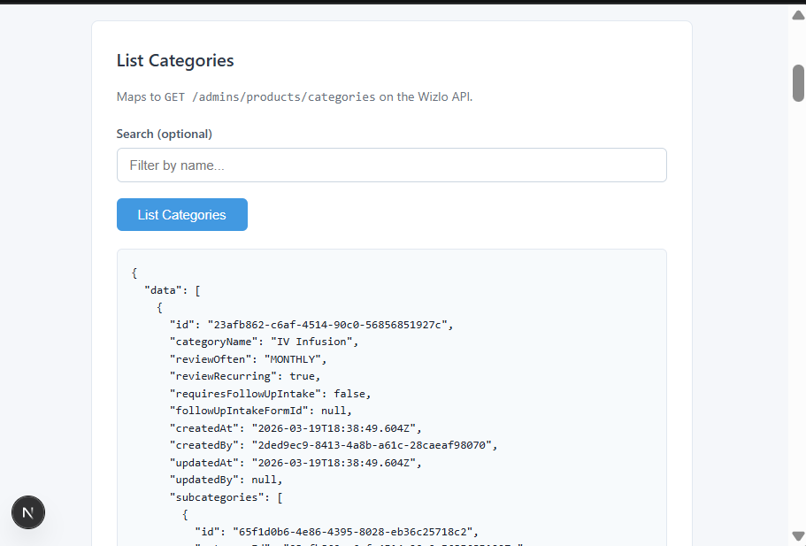
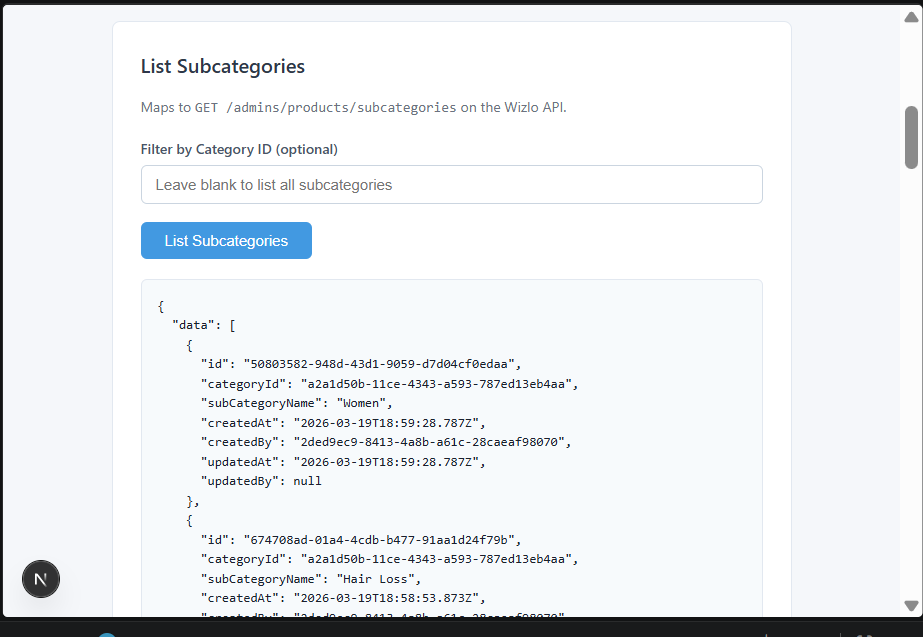
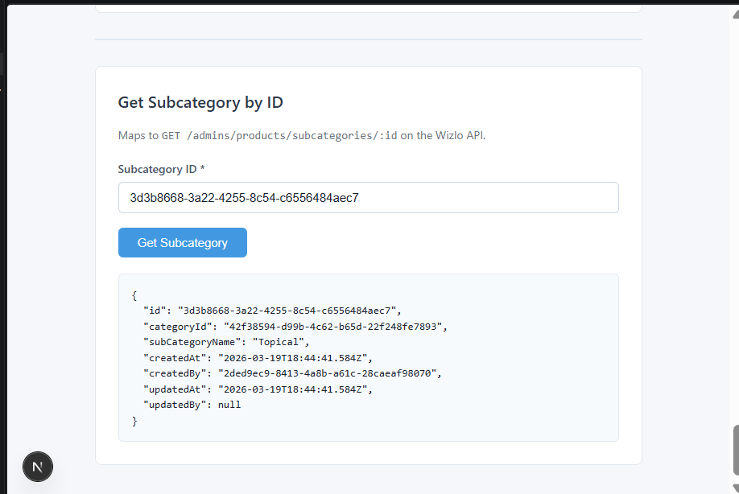
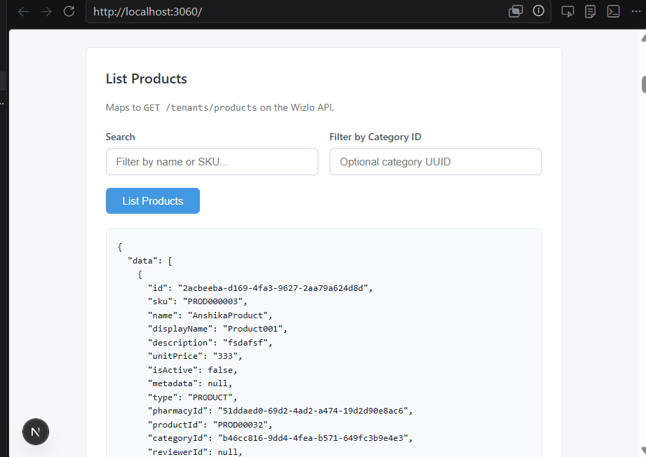
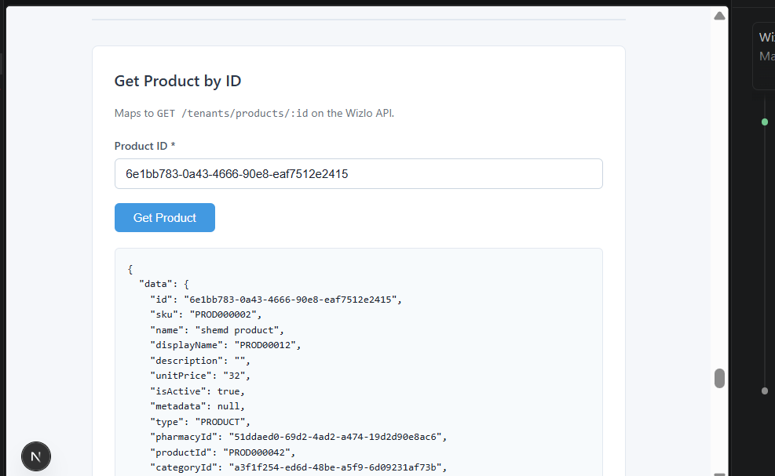

# Wizlo Products Sample

Demonstrates how to manage products, categories, and subcategories via the Wizlo API.

---

## Prerequisites

- Node.js 18+
- Wizlo UAT credentials (`WIZLO_CLIENT_ID`, `WIZLO_CLIENT_SECRET`)

---

## Setup

### 1. Backend

```bash
cd backend
cp .env.example .env
```

Fill in your credentials in `.env`:

```env
PORT=3050
WIZLO_BASE_URL=https://api-uat.wizlo.com
WIZLO_CLIENT_ID=your_client_id
WIZLO_CLIENT_SECRET=your_client_secret
```

```bash
npm install
npm run dev
# Runs at http://localhost:3050
```

### 2. Frontend

```bash
cd frontend
cp .env.local.example .env.local
npm install
npm run dev
# Runs at http://localhost:3060
```

Open [http://localhost:3060](http://localhost:3060) in your browser.

---

## How It Works

```
Browser → Next.js (3060) → NestJS (3050) → Wizlo API
```

- The frontend calls the NestJS backend
- NestJS fetches an OAuth2 Bearer token automatically using `client_credentials` (cached and refreshed before expiry)
- NestJS forwards the request to the Wizlo API and returns the response

---

## Step-by-Step Flow

The UI has three tabs: **Categories**, **Subcategories**, and **Products**.

---

### Step 1 — Create a Category

Go to the **Categories** tab. Fill in:

- **Category Name** *(required)*
- **Review Frequency** *(optional)* — Weekly, Monthly, Quarterly, etc.
- **Review Recurring** *(optional)* — toggle on/off

Click **Create Category**. Copy the `id` from the response — you will need it in the next steps.

---

### Step 2 — List Categories

Click **List Categories** to view all categories. Use the **Search** field to filter by name.



---

### Step 3 — Create a Subcategory

Go to the **Subcategories** tab. Fill in:

- **Category ID** — paste the `id` from Step 1
- **Subcategory Name** *(required)*

Click **Create Subcategory**.

---

### Step 4 — List Subcategories

Click **List Subcategories**. Optionally enter a **Category ID** to filter subcategories by category.



---

### Step 5 — Get Subcategory by ID

Enter a subcategory UUID and click **Get Subcategory** to view its full details.



---

### Step 6 — Create a Product

Go to the **Products** tab and fill in the **Create Product** form.

| Field | Required | Description |
|-------|----------|-------------|
| Name | Yes | Product name |
| SKU | Yes | Unique stock-keeping unit |
| Product ID | Yes | Identifier — letters, numbers, hyphens, underscores only |
| Unit Price | Yes | Price in dollars |
| Pharmacy ID | Yes | UUID of the dispensing pharmacy |
| Clinic IDs | Yes | Comma-separated clinic UUIDs |
| Category ID | Yes | UUID from the Categories tab |
| Subcategory ID | No | UUID from the Subcategories tab |
| Encounter Mode | No | `ASYNCHRONOUS` or `SYNCHRONOUS` |
| Encounter Type | No | `STANDARD` or `HRT` |
| Encounter Required | No | Whether an encounter is required before ordering |
| Requires Labs | No | Whether lab results are required |
| Rx Details | No | Expand to fill drug form, strength, qty, days supply, refills, directions |

Click **Create Product** to submit.

> **Note:** The Category ID must be a valid category in the Wizlo tenant context. Use the `id` value from the **List Categories** response.

---

### Step 7 — List Products

Click **List Products** to view all products. Filter by name/SKU using the **Search** field, or narrow results by **Category ID**.



---

### Step 8 — Get Product by ID

Enter a product UUID and click **Get Product** to view its full details.



---

## API Reference

### Categories

| Method | Endpoint | Description |
|--------|----------|-------------|
| `POST` | `/admins/products/categories` | Create a category |
| `GET` | `/admins/products/categories` | List categories |
| `GET` | `/admins/products/categories/:id` | Get a category |
| `PUT` | `/admins/products/categories/:id` | Update a category |
| `DELETE` | `/admins/products/categories/:id` | Delete a category |

```bash
# Create
curl -X POST http://localhost:3050/categories \
  -H "Content-Type: application/json" \
  -d '{ "categoryName": "Weight Loss", "reviewOften": "MONTHLY", "reviewRecurring": true }'

# List
curl "http://localhost:3050/categories?search=Weight&page=1&limit=20"

# Get by ID
curl http://localhost:3050/categories/<CATEGORY_ID>
```

### Subcategories

| Method | Endpoint | Description |
|--------|----------|-------------|
| `POST` | `/admins/products/subcategories` | Create a subcategory |
| `GET` | `/admins/products/subcategories` | List subcategories |
| `GET` | `/admins/products/subcategories/:id` | Get a subcategory |
| `PUT` | `/admins/products/subcategories/:id` | Update a subcategory |
| `DELETE` | `/admins/products/subcategories/:id` | Delete a subcategory |

```bash
# Create
curl -X POST http://localhost:3050/subcategories \
  -H "Content-Type: application/json" \
  -d '{ "categoryId": "<CATEGORY_ID>", "subCategoryName": "GLP-1 Injectable" }'

# List (filter by category)
curl "http://localhost:3050/subcategories?categoryId=<CATEGORY_ID>"

# Get by ID
curl http://localhost:3050/subcategories/<SUBCATEGORY_ID>
```

### Products

| Method | Endpoint | Description |
|--------|----------|-------------|
| `POST` | `/tenants/products` | Create a product |
| `GET` | `/tenants/products` | List products |
| `GET` | `/tenants/products/:id` | Get a product |
| `PUT` | `/tenants/products/:id` | Update a product |
| `DELETE` | `/tenants/products/:id` | Delete a product |

```bash
# Create
curl -X POST http://localhost:3050/products \
  -H "Content-Type: application/json" \
  -d '{
    "name": "Semaglutide 0.5mg",
    "sku": "SEM-0.5-30",
    "productId": "SEM-050",
    "unitPrice": 399,
    "pharmacyId": "51ddaed0-69d2-4ad2-a474-19d2d90e8ac6",
    "clinicIds": ["1d836ade-bb7e-47a5-9f4a-d2c45ad8dad6"],
    "categoryId": "<CATEGORY_ID>",
    "isEncounterRequired": false,
    "requiresLabs": false
  }'

# List (with optional filters)
curl "http://localhost:3050/products?search=Sema&page=1&limit=20"

# Get by ID
curl http://localhost:3050/products/<PRODUCT_ID>

# Update
curl -X PUT http://localhost:3050/products/<PRODUCT_ID> \
  -H "Content-Type: application/json" \
  -d '{ "unitPrice": 450 }'

# Delete
curl -X DELETE http://localhost:3050/products/<PRODUCT_ID>
```
