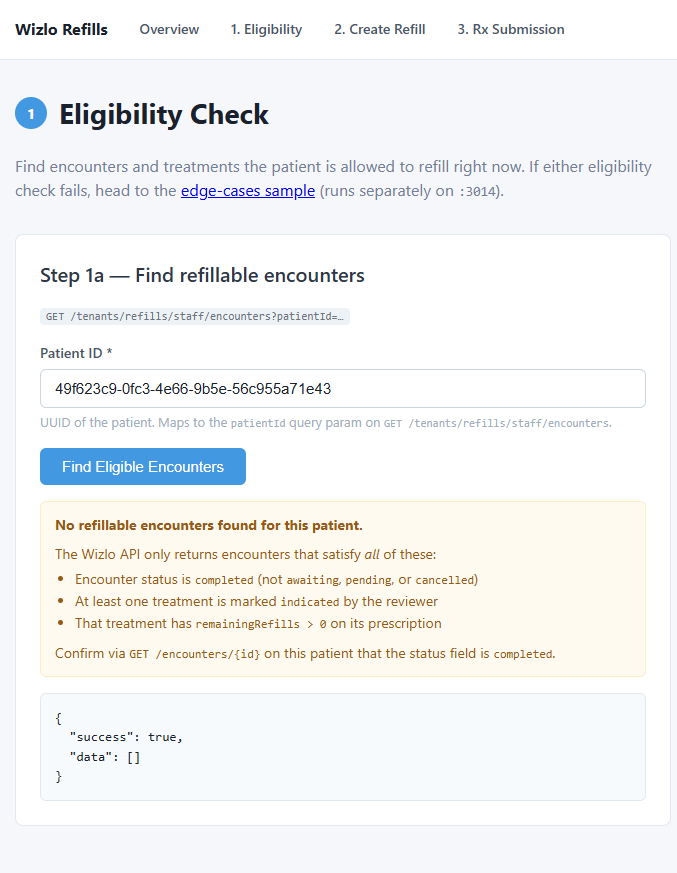

# Wizlo Refills Sample

End-to-end refill workflow against the Wizlo API. NestJS backend + Next.js frontend, structured the same way as the [`orders/`](../orders) and [`intake-form/`](../intake-form) samples from Sprint 1.

> A **refill** transmits an already-approved prescription to the pharmacy again. It does **not** create a new prescription — the medication, drug strength, quantity, and directions are fixed at the time the prescription was written. The refill API accepts only `encounterTreatmentId`s.

---

## What This Sample Demonstrates

- OAuth2 client-credentials authentication with Wizlo (shared singleton `WizloService`)
- Listing refillable encounters & treatments for a patient
- Creating a refill order with one or many treatments — including the staff-only `bypassDaysOfSupply` override
- Marking the order paid and transmitting the Rx to the pharmacy provider
- Handling the two failure modes the docs call out: `no_refills_remaining` and `cannot_refill_now`

---

## Folder Structure

```
refills/
├── README.md
├── screenshots/
├── backend/                 ← NestJS API at :3003 (main happy path)
│   └── src/
│       ├── main.ts
│       ├── app.module.ts
│       ├── wizlo/           ← OAuth + HTTP helper (shared)
│       ├── eligibility/     ← Step 1
│       ├── refill-orders/   ← Step 2
│       └── rx-submission/   ← Step 3
├── frontend/                ← Next.js 14 App Router at :3013
│   └── src/
│       ├── lib/api.ts       ← thin client for the backend
│       └── app/
│           ├── page.tsx              ← overview
│           ├── eligibility/page.tsx  ← step 1
│           ├── create-refill/page.tsx← step 2
│           └── rx-submission/page.tsx← step 3 (4-checkpoint stepper)
└── edgecases/               ← standalone sample for failure-mode handling
    ├── README.md
    ├── screenshots/
    ├── backend/             ← NestJS API at :3004
    └── frontend/            ← Next.js at :3014
```

The **happy path** (eligibility → create → mark paid → submit rx) is in `backend/` + `frontend/`. The **edge cases** (`no_refills_remaining`, days-of-supply window, staff bypass) are broken out into [`edgecases/`](./edgecases) so the main flow stays uncluttered. See [`edgecases/README.md`](./edgecases/README.md) for that sample's setup.

---

## Prerequisites

- Node.js 18+
- Wizlo UAT credentials (`WIZLO_CLIENT_ID`, `WIZLO_CLIENT_SECRET`)
- A patient UUID with at least one **completed** encounter containing **indicated** treatments

---

## Setup

### 1. Backend

```bash
cd backend
cp .env.example .env
# fill in WIZLO_CLIENT_ID + WIZLO_CLIENT_SECRET
npm install
npm run dev
# Refills backend running on http://localhost:3003
```

`.env` keys:

```env
PORT=3003
WIZLO_BASE_URL=https://api-uat.wizlo.com
WIZLO_CLIENT_ID=your_client_id
WIZLO_CLIENT_SECRET=your_client_secret
WIZLO_CLINIC_ID=1d836ade-bb7e-47a5-9f4a-d2c45ad8dad6
```

### 2. Frontend

```bash
cd frontend
cp .env.local.example .env.local
npm install
npm run dev
# Refills frontend running on http://localhost:3013
```

---

## End-to-End Workflow

```
┌─ Step 1 ────────────────────────────────────────────────────────────┐
│  GET  /tenants/refills/staff/encounters?patientId=…                 │
│  GET  /tenants/refills/staff/encounter/:id/treatments               │
│  → Decide: remainingRefills > 0 && canRefillNow === true ?          │
└─────────────────────────────────────────────────────────────────────┘
                              │
                              ▼
┌─ Step 2 ────────────────────────────────────────────────────────────┐
│  POST /tenants/refills/staff/create                                 │
│  → Returns orderId (status: pending, orderType: REFILL)             │
└─────────────────────────────────────────────────────────────────────┘
                              │
                              ▼
┌─ Step 3 ────────────────────────────────────────────────────────────┐
│  POST /tenants/orders/bulk/mark-paid          (required first)      │
│  POST /rx/orders/:orderId/submit-refill-rx    (transmit)            │
│  → rxStatus: transmitted                                            │
└─────────────────────────────────────────────────────────────────────┘
```

The frontend's nav bar exposes each step as its own page. Each page deep-links to the next with the IDs pre-filled, so you can run the whole flow click-by-click.

---

## Step-by-Step

### Step 1 — Eligibility check &nbsp;·&nbsp; `/eligibility`

Find encounters with refillable treatments, then drill into one and see per-treatment refill status.



### Step 2 — Create refill order &nbsp;·&nbsp; `/create-refill`

Pre-filled with the `patientId` and `encounterTreatmentId`s from step 1 via query string. Optional `bypassDaysOfSupply` checkbox for staff overrides.


### Step 3 — Rx submission &nbsp;·&nbsp; `/rx-submission`

4-checkpoint stepper UI (Order → Mark Paid → Submit Rx → Transmitted), one panel visible at a time — same pattern as `subscriptions/2-enrollment`. Each checkpoint advances only after the previous API call succeeds, mirroring the constraint that the order must be in `paid` status before transmission.

The page also surfaces a **Notes &amp; Requirements** callout covering the four preconditions every refill order has to satisfy: source encounter in `completed` status, every treatment `indicated` with an associated product, order in `paid` status before submit-rx, and the medication/dosage being inherited (not editable).


### Edge Cases &nbsp;·&nbsp; [`edgecases/`](./edgecases) (separate sample)

Failure-mode handling lives in a standalone sibling sample running on backend `:3004` + frontend `:3014`. Covers:

- `remainingRefills = 0` → `400 REFILL_NOT_ELIGIBLE`. Not recoverable; needs a new encounter.
- `canRefillNow = false` while `remainingRefills > 0` → either wait, or staff override with `bypassDaysOfSupply: true`.

See [`edgecases/README.md`](./edgecases/README.md) for setup.

---

## Backend API surface

The frontend talks to the backend; the backend talks to Wizlo with a bearer token.

| Frontend page | Backend route | Wizlo endpoint |
|---|---|---|
| `/eligibility` | `GET /eligibility/encounters?patientId=…` | `GET /tenants/refills/staff/encounters` |
| `/eligibility` | `GET /eligibility/encounter/:id/treatments` | `GET /tenants/refills/staff/encounter/:id/treatments` |
| `/create-refill` | `POST /refill-orders` | `POST /tenants/refills/staff/create` |
| `/rx-submission` | `POST /rx-submission/mark-paid` | `POST /tenants/orders/bulk/mark-paid` |
| `/rx-submission` | `POST /rx-submission/submit/:orderId` | `POST /rx/orders/:orderId/submit-refill-rx` |

You can call the backend directly with curl too:

```bash
# Step 1
curl "http://localhost:3003/eligibility/encounters?patientId=98d2799e-…"
curl "http://localhost:3003/eligibility/encounter/78/treatments"

# Step 2
curl -X POST http://localhost:3003/refill-orders \
  -H "Content-Type: application/json" \
  -d '{
    "patientId": "98d2799e-…",
    "encounterTreatmentIds": ["6e6e4fbc-…"]
  }'

# Step 3
curl -X POST http://localhost:3003/rx-submission/mark-paid \
  -H "Content-Type: application/json" \
  -d '{ "orderIds": ["33669dde-…"] }'

curl -X POST http://localhost:3003/rx-submission/submit/33669dde-…
```

---

## Where to look in the docs

- **Concept walkthrough:** [`docs/guides/refills.mdx`](../../docs/guides/refills.mdx)
- **Subscription + refill lifecycle:** [`docs/guides/subscription-refill-lifecycle.mdx`](../../docs/guides/subscription-refill-lifecycle.mdx)
- **API references:** [get-eligible-refill-encounters](../../docs/api-reference/apis/get-eligible-refill-encounters.mdx) · [create-refill-order](../../docs/api-reference/apis/create-refill-order.mdx) · [submit-refill-rx](../../docs/api-reference/apis/submit-refill-rx.mdx) · [get-encounter-refill-orders](../../docs/api-reference/apis/get-encounter-refill-orders.mdx)
