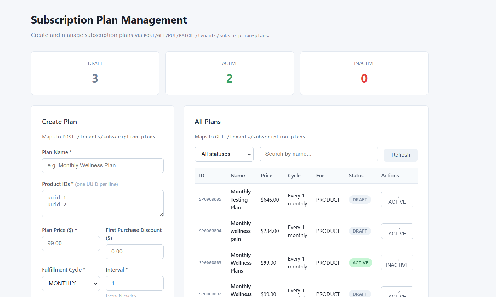
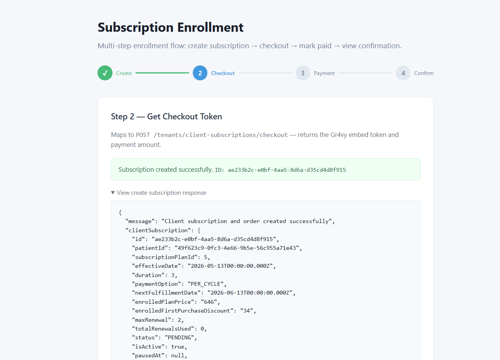
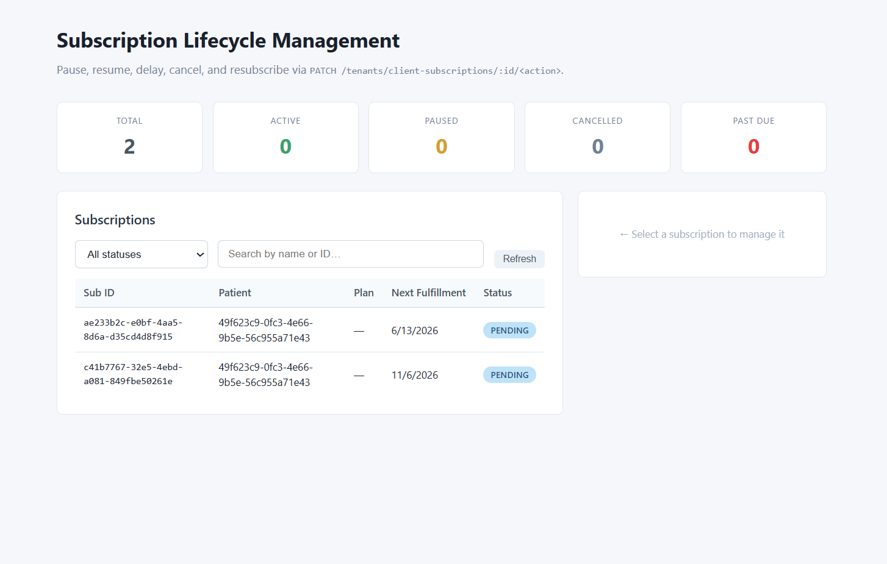
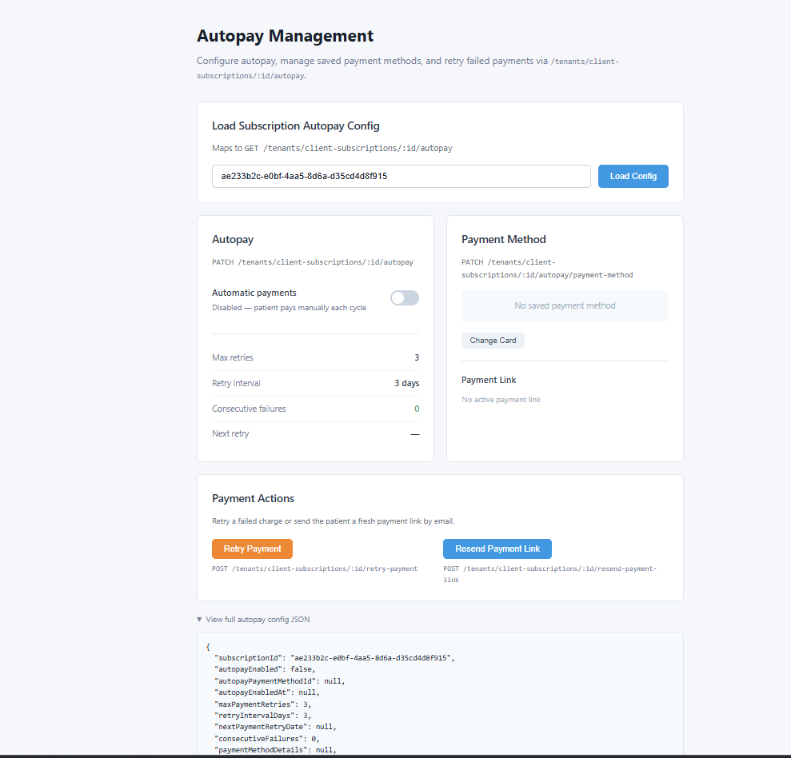

# Wizlo Subscription Module — Samples

Five focused, self-contained NestJS + Next.js 14 samples covering the full Wizlo Subscription API (30+ endpoints). Follow the samples in order — each one builds on the output of the previous.

## Samples at a Glance

| # | Sample | What it demonstrates | Backend | Frontend |
|---|--------|----------------------|:-------:|:--------:|
| 1 | [Plan Management](#1-plan-management) | Create & manage subscription plans | `:3020` | `:3030` |
| 2 | [Enrollment](#2-enrollment) | Enroll a patient, collect payment via Gr4vy | `:3021` | `:3031` |
| 3 | [Lifecycle Management](#3-lifecycle-management) | Pause, resume, cancel, delay, resubscribe | `:3022` | `:3032` |
| 4 | [Autopay](#4-autopay) | Toggle autopay, change payment method, retry | `:3023` | `:3033` |
| 5 | [Patient Portal](#5-patient-portal) | Patient self-service — view, manage, book labs | `:3024` | `:3034` |

---

## Prerequisites

- Node.js 18+
- Wizlo API credentials (see [Environment Variables](#environment-variables))
- Gr4vy credentials (Sample 2 & 4 only)

---

## 1. Plan Management

Create and manage the subscription plan catalogue — the products, pricing, and fulfillment schedule that patients subscribe to.



### APIs Covered

| Method | Endpoint | Description |
|--------|----------|-------------|
| `POST` | `/tenants/subscription-plans` | Create a new plan (defaults to `DRAFT`) |
| `GET` | `/tenants/subscription-plans` | List plans with filtering, search & pagination |
| `GET` | `/tenants/subscription-plans/status-counts` | Dashboard counts (DRAFT / ACTIVE / INACTIVE) |
| `GET` | `/tenants/subscription-plans/:id` | Get full plan details |
| `PUT` | `/tenants/subscription-plans/:id` | Update plan fields |
| `PATCH` | `/tenants/subscription-plans/:id/status` | Publish (`ACTIVE`) or deactivate a plan |

### Running Locally

```bash
# Backend
cd 1-plan-management/backend
cp .env.example .env        # fill in Wizlo credentials
npm install
npm run dev                 # http://localhost:3020

# Frontend (new terminal)
cd 1-plan-management/frontend
cp .env.local.example .env.local
npm install
npm run dev                 # http://localhost:3030
```

### Key Fields — Create / Update Plan

| Field | Type | Required | Notes |
|-------|------|:--------:|-------|
| `name` | `string` | ✓ | Max 255 chars |
| `productIds` | `string[]` | ✓ | Array of product UUIDs |
| `planPrice` | `number` | ✓ | Positive, 2 decimal places |
| `fulfillmentCycle` | `DAILY\|WEEKLY\|MONTHLY\|YEARLY` | ✓ | |
| `fulfillmentInterval` | `number` | ✓ | Integer ≥ 1 |
| `reassessmentFormId` | `string (UUID)` | ✓ | |
| `firstPurchaseDiscount` | `number` | | Optional discount amount |
| `maxRenewal` | `number\|null` | | `null` = unlimited renewals |
| `status` | `DRAFT\|ACTIVE\|INACTIVE` | | Defaults to `DRAFT` |
| `planCreatedFor` | `PRODUCT\|SERVICE` | | Defaults to `PRODUCT` |

---

## 2. Enrollment

The core subscription flow: enroll a patient into a plan, collect payment via the Gr4vy embedded UI, and activate the subscription.



### Enrollment Flow

```
Step 1  Fill form     →  POST /client-subscriptions          →  PENDING + subscriptionId
Step 2  Pay Now       →  POST /client-subscriptions/checkout →  Gr4vy token + amount
Step 3  Gr4vy embed   →  Patient enters card details
Step 4  On success    →  POST /client-subscriptions/mark-paid  →  ACTIVE
Step 5  Confirmation  →  GET  /client-subscriptions/:id + orders + transactions
```

### APIs Covered

| Method | Endpoint | Description |
|--------|----------|-------------|
| `POST` | `/tenants/client-subscriptions` | Create subscription → status `PENDING` |
| `POST` | `/tenants/client-subscriptions/checkout` | Get Gr4vy embed token + amount |
| `POST` | `/tenants/client-subscriptions/mark-paid` | Activate after payment → status `ACTIVE` |
| `GET` | `/tenants/client-subscriptions/:id` | Fetch full subscription details |
| `GET` | `/tenants/client-subscriptions/:id/orders` | View generated orders |
| `GET` | `/tenants/client-subscriptions/:id/transactions` | View payment transactions |

### Running Locally

```bash
# Backend
cd 2-enrollment/backend
cp .env.example .env        # fill in Wizlo + Gr4vy credentials
npm install
npm run dev                 # http://localhost:3021

# Frontend (new terminal)
cd 2-enrollment/frontend
cp .env.local.example .env.local
npm install
npm run dev                 # http://localhost:3031
```

### Key Fields

**Create Subscription**

| Field | Type | Required | Notes |
|-------|------|:--------:|-------|
| `patientId` | `UUID` | ✓ | Patient's Wizlo UUID |
| `subscriptionPlanId` | `string` | ✓ | Plan ID from Sample 1 |
| `effectiveDate` | `ISO date` | | Defaults to today |
| `duration` | `number\|null` | | Months; `null` = infinite |
| `clinicId` | `UUID` | | Clinic to associate |
| `deferEncounterCreation` | `boolean` | | Default `false` |

**Mark Paid**

| Field | Type | Required |
|-------|------|:--------:|
| `clientSubscriptionId` | `UUID` | ✓ |
| `transactionId` | `string` | ✓ (Gr4vy transaction ID) |

---

## 3. Lifecycle Management

All admin-side state transitions for an active subscription — pause, resume, delay, cancel, resubscribe — plus the full audit timeline.



### Status Machine

```
PENDING        ──(mark-paid)────► ACTIVE
ACTIVE         ──(pause)────────► PAUSED
PAUSED         ──(resume)───────► ACTIVE
ACTIVE         ──(cancel)───────► CANCELLED
CANCELLED      ──(resubscribe)──► PENDING
ACTIVE         ──(delay)────────► ACTIVE  (next fulfillment date shifted)
PAYMENT_FAILED ──(retry)────────► ACTIVE
```

### APIs Covered

| Method | Endpoint | Description |
|--------|----------|-------------|
| `GET` | `/tenants/client-subscriptions` | List subscriptions with status / search filters |
| `GET` | `/tenants/client-subscriptions/stats` | Dashboard counts by status |
| `PATCH` | `/tenants/client-subscriptions/:id/pause` | Pause (optional `pausedUntilDate`) |
| `PATCH` | `/tenants/client-subscriptions/:id/resume` | Resume a paused subscription |
| `PATCH` | `/tenants/client-subscriptions/:id/cancel` | Cancel with reason |
| `PATCH` | `/tenants/client-subscriptions/:id/delay` | Push next fulfillment date |
| `PATCH` | `/tenants/client-subscriptions/:id/resubscribe` | Re-enroll a cancelled subscription |
| `GET` | `/tenants/client-subscriptions/:id/timeline` | Full audit trail with timestamps |

### Running Locally

```bash
# Backend
cd 3-lifecycle-management/backend
cp .env.example .env
npm install
npm run dev                 # http://localhost:3022

# Frontend (new terminal)
cd 3-lifecycle-management/frontend
cp .env.local.example .env.local
npm install
npm run dev                 # http://localhost:3032
```

### Key DTOs

| Action | Required Fields | Optional Fields |
|--------|----------------|-----------------|
| Pause | — | `pausedUntilDate` (ISO date) |
| Cancel | `reason` (see below) | `description` |
| Delay | `newFulfillmentDate` (ISO date) | — |
| Resubscribe | — | — |
| Resume | — | — |

**Cancellation Reasons**
- `I am experiencing too many side effects`
- `Completed the current treatment`
- `Too expensive`
- `Using another company's product`
- `Health or medical reasons`
- `Others`

---

## 4. Autopay

Configure autopay, update saved payment methods, and manually retry failed payments.



### APIs Covered

| Method | Endpoint | Description |
|--------|----------|-------------|
| `GET` | `/tenants/client-subscriptions/:id/autopay` | Get autopay config, retry settings & saved card |
| `PATCH` | `/tenants/client-subscriptions/:id/autopay` | Enable / disable autopay |
| `PATCH` | `/tenants/client-subscriptions/:id/autopay/payment-method` | Change saved payment method |
| `POST` | `/tenants/client-subscriptions/:id/retry-payment` | Manually trigger payment retry |
| `POST` | `/tenants/client-subscriptions/:id/resend-payment-link` | Email a fresh payment link to the patient |

### Running Locally

```bash
# Backend
cd 4-autopay/backend
cp .env.example .env
npm install
npm run dev                 # http://localhost:3023

# Frontend (new terminal)
cd 4-autopay/frontend
cp .env.local.example .env.local
npm install
npm run dev                 # http://localhost:3033
```

### Key DTOs

**Enable Autopay**
```json
{ "autopayEnabled": true, "autopayPaymentMethodId": "gr4vy-payment-method-id" }
```
> `autopayPaymentMethodId` is required when enabling autopay.

**Change Payment Method**
```json
{ "paymentMethodId": "gr4vy-payment-method-id" }
```

**Autopay Response**
```json
{
  "subscriptionId": "uuid",
  "autopayEnabled": true,
  "autopayPaymentMethodId": "...",
  "maxPaymentRetries": 3,
  "retryIntervalDays": 3,
  "nextPaymentRetryDate": "2026-05-16T00:00:00Z",
  "consecutiveFailures": 1,
  "paymentMethodDetails": {
    "scheme": "visa",
    "details": { "cardNumberLast4": "4242" },
    "expirationDate": "12/2027"
  }
}
```

---

## 5. Patient Portal

Patient-facing self-service endpoints — everything a patient portal would call to view and manage their own subscriptions, including PSC lab appointment scheduling.

> **Auth note:** In production these endpoints are called with a **patient JWT**. This sample uses client-credentials (staff scope) for demo purposes.

### APIs Covered

| Method | Endpoint | Description |
|--------|----------|-------------|
| `GET` | `/tenants/patient-subscriptions` | Patient's own subscription list |
| `GET` | `/tenants/patient-subscriptions/stats` | Patient's subscription counts |
| `GET` | `/tenants/patient-subscriptions/:id` | Full details with billing breakdown |
| `GET` | `/tenants/patient-subscriptions/psc-locations` | Find PSC lab locations by ZIP code |
| `PATCH` | `/tenants/patient-subscriptions/:id/pause` | Patient self-pause |
| `PATCH` | `/tenants/patient-subscriptions/:id/resume` | Patient self-resume |
| `PATCH` | `/tenants/patient-subscriptions/:id/cancel` | Patient self-cancel with reason |
| `PATCH` | `/tenants/patient-subscriptions/:id/delay` | Patient shifts next fulfillment date |
| `PATCH` | `/tenants/patient-subscriptions/:id/schedule-lab` | Book PSC lab appointment |

### Running Locally

```bash
# Backend
cd 5-patient-portal/backend
cp .env.example .env
npm install
npm run dev                 # http://localhost:3024

# Frontend (new terminal)
cd 5-patient-portal/frontend
cp .env.local.example .env.local
npm install
npm run dev                 # http://localhost:3034
```

### Key DTOs

| Action | Required Fields | Optional Fields |
|--------|----------------|-----------------|
| Pause | — | `pausedUntilDate` (ISO date) |
| Cancel | `reason` (enum) | `description` |
| Delay | `newFulfillmentDate` (ISO date) | — |
| Schedule Lab | `bookingKey` | `asyncConfirmation`, `idempotencyKey` |

**Schedule Lab Response**
```json
{
  "message": "Lab appointment scheduled",
  "labOrderId": "...",
  "subscriptionStatus": "ACTIVE",
  "labAppointment": { ... }
}
```

---

## Environment Variables

All five backends share the same base variables. Copy `.env.example` → `.env` in each `backend/` folder.

```env
WIZLO_BASE_URL=https://api-uat.wizlo.com
WIZLO_CLIENT_ID=your_client_id
WIZLO_CLIENT_SECRET=your_client_secret
WIZLO_TENANT_ID=your_tenant_id
```

Samples 2 and 4 additionally require Gr4vy credentials:

```env
GR4VY_ID=your_gr4vy_id
GR4VY_ENVIRONMENT=sandbox
GR4VY_PRIVATE_KEY_BASE64=<base64-encoded PKCS#8 private key>
```

---

## Running All Samples at Once

From the repo root:

```bash
npm install        # installs concurrently
npm run dev        # starts all 10 processes (5 backends + 5 frontends)
```

Or run a single sample pair:

```bash
npm run dev --workspace=subscriptions/1-plan-management/backend &
npm run dev --workspace=subscriptions/1-plan-management/frontend
```

---

## Recommended Order

Run the samples in sequence — each depends on data created by the previous:

1. **Plan Management** — no dependencies; create a plan and note its ID
2. **Enrollment** — requires a plan ID from Step 1; produces a subscription ID
3. **Lifecycle Management** — requires an active subscription from Step 2
4. **Autopay** — requires an active subscription with a saved payment method from Step 2
5. **Patient Portal** — mirrors Steps 2–4 from the patient's perspective
