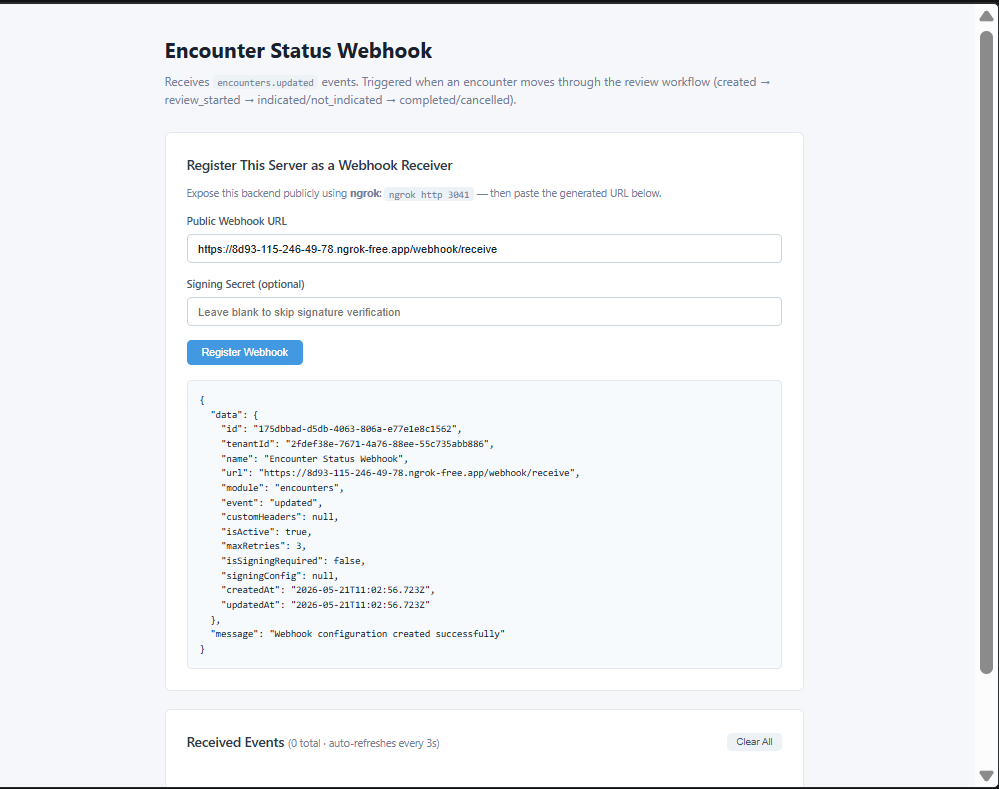
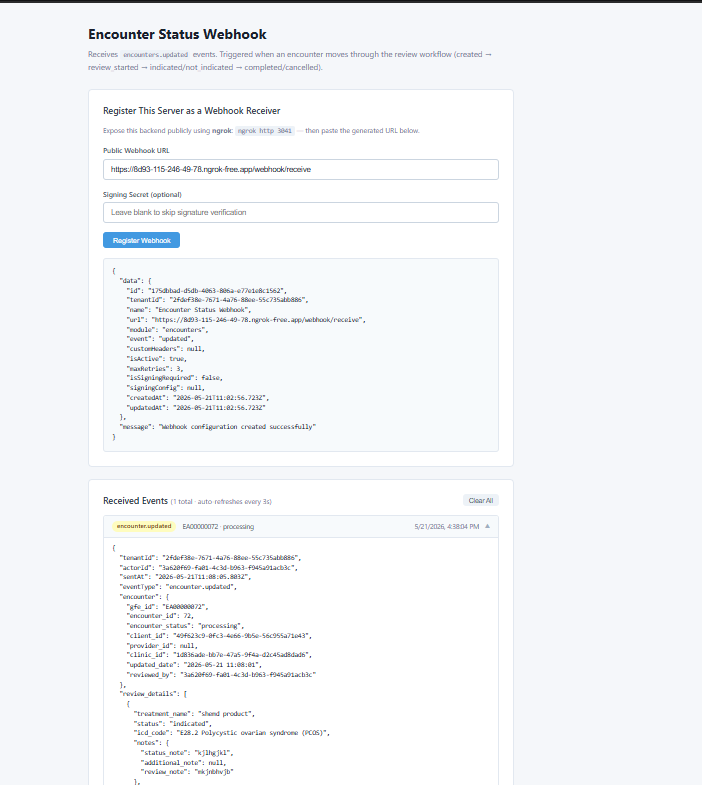

# Encounter Status Webhook

Receives **`encounters.updated`** events from Wizlo. Triggered when an encounter moves through the review workflow: `created → review_started → indicated/not_indicated → completed/cancelled`.

## What it does

When a clinician reviews an encounter in Wizlo UAT and changes its status, Wizlo sends a signed POST request to your registered webhook URL. This sample receives that event, stores it in memory, and displays it in a live-updating frontend.

## Ports

| Service  | Port |
|----------|------|
| Backend  | 3041 |
| Frontend | 3051 |

## Setup

**1. Create the `.env` file in `backend/`:**
```
WIZLO_BASE_URL=https://api-uat.wizlo.com
WIZLO_CLIENT_ID=your_client_id
WIZLO_CLIENT_SECRET=your_client_secret
WEBHOOK_SECRET=
WEBHOOK_SIGNING_HEADER=x-webhook-signature
PORT=3041
```

**2. Install and run the backend:**
```bash
cd backend
npm install
npm run dev
```

**3. Install and run the frontend:**
```bash
cd frontend
npm install
npm run dev
```

**4. Start ngrok:**
```bash
ngrok http 3041
```

## Steps to test

1. Open `http://localhost:3051` in your browser
2. Paste your ngrok URL in the **Public Webhook URL** field:
   ```
   https://xxxx.ngrok-free.app/webhook/receive
   ```
3. Click **Register Webhook** — you should see a success response
4. Log into Wizlo UAT and open any encounter
5. Change the encounter status (approve, reject, complete, cancel)
6. The event appears in **Received Events** within 3 seconds

## Event payload example

```json
{
  "tenantId": "2fdef38e-...",
  "eventType": "updated",
  "encounter": {
    "gfe_id": "EA00000072",
    "encounter_status": "processing",
    "clinic_id": "...",
    "updated_date": "2026-05-21T11:08:01"
  }
}
```

## Screenshots

**Webhook registered and event received:**



**Live event payload:**


