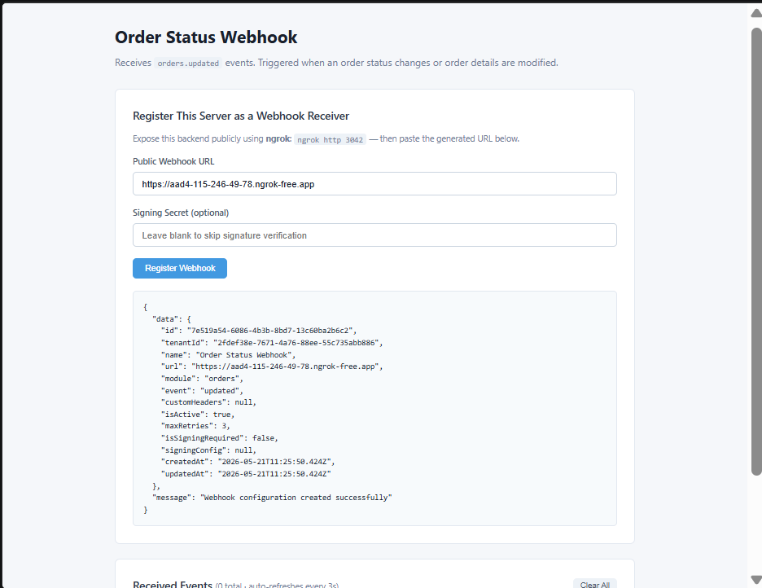
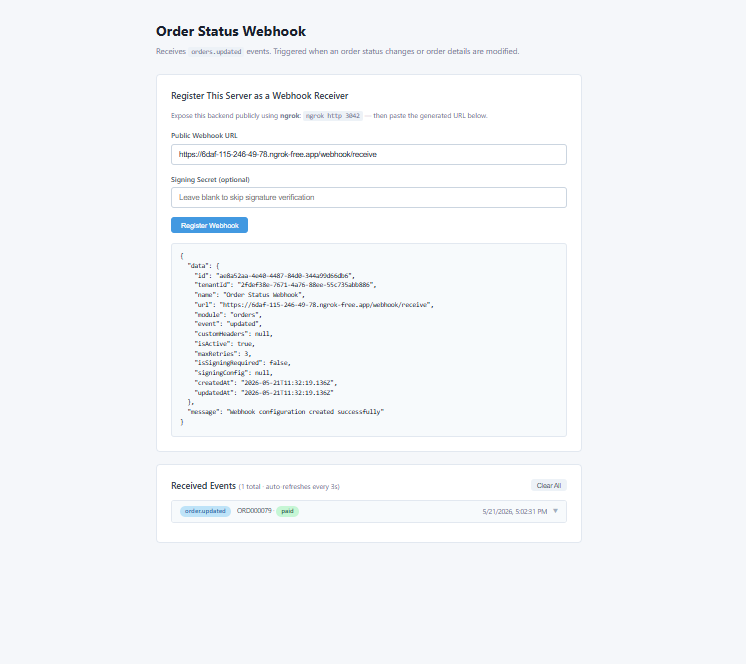

# Order Status Webhook

Receives **`orders.updated`** events from Wizlo. Triggered when an order status changes or order details are modified.

## What it does

When an order is created, updated, or its payment status changes in Wizlo UAT, Wizlo sends a POST request to your registered webhook URL. This sample receives the event, stores it in memory, and shows it in a live-updating frontend.

## Ports

| Service  | Port |
|----------|------|
| Backend  | 3042 |
| Frontend | 3052 |

## Setup

**1. Create the `.env` file in `backend/`:**
```
WIZLO_BASE_URL=https://api-uat.wizlo.com
WIZLO_CLIENT_ID=your_client_id
WIZLO_CLIENT_SECRET=your_client_secret
WEBHOOK_SECRET=
WEBHOOK_SIGNING_HEADER=x-webhook-signature
PORT=3042
```

**2. Install and run the backend:**
```bash
cd backend
npm install
npm run dev
```

**3. Install and run the frontend:**
```bash
cd frontend
npm install
npm run dev
```

**4. Start ngrok:**
```bash
ngrok http 3042
```

## Steps to test

1. Open `http://localhost:3052` in your browser
2. Paste your ngrok URL in the **Public Webhook URL** field:
   ```
   https://xxxx.ngrok-free.app/webhook/receive
   ```
3. Click **Register Webhook** — confirm success response
4. Log into Wizlo UAT and create or update an order
5. Change the order status (e.g. mark as paid, fulfill, cancel)
6. The event appears in **Received Events** within 3 seconds

> **Note:** Make sure the URL includes `/webhook/receive` at the end.

## Event payload example

```json
{
  "eventType": "updated",
  "order_details": [
    {
      "order_id": "...",
      "order_status": "paid"
    }
  ]
}
```

## Screenshots

**Webhook registered successfully:**



**Event received in live log:**


