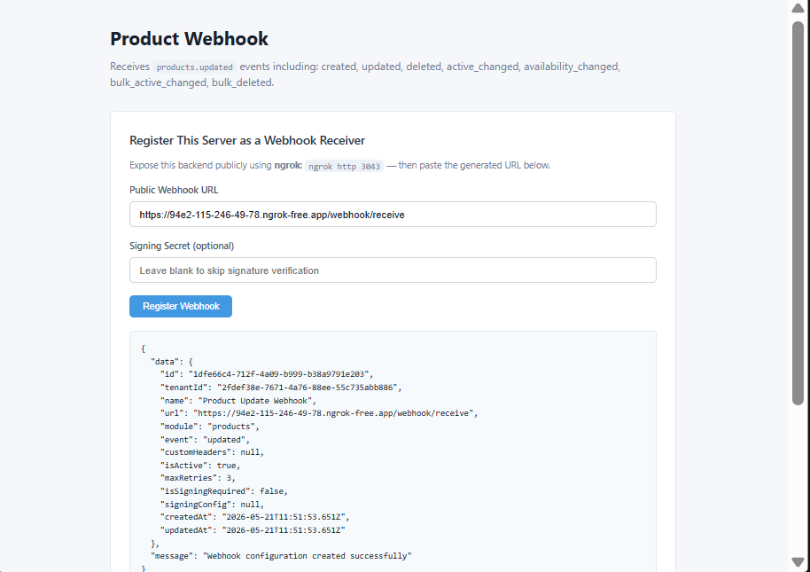
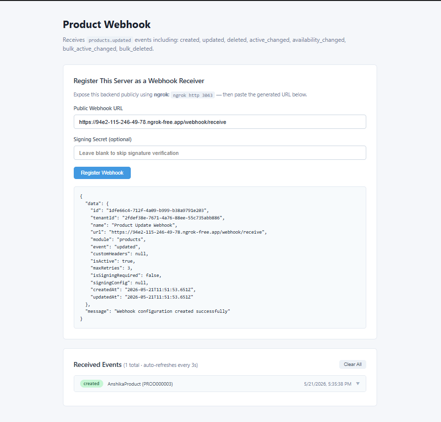

# Product Update Webhook

Receives **`products.updated`** events from Wizlo. Triggered when a product's name, price, status, or any other detail is modified.

## What it does

When a product is edited and saved in Wizlo UAT, Wizlo sends a POST request to your registered webhook URL. This sample receives the event, stores it, and displays it in a live-updating frontend.

## Ports

| Service  | Port |
|----------|------|
| Backend  | 3043 |
| Frontend | 3053 |

## Setup

**1. Create the `.env` file in `backend/`:**
```
WIZLO_BASE_URL=https://api-uat.wizlo.com
WIZLO_CLIENT_ID=your_client_id
WIZLO_CLIENT_SECRET=your_client_secret
WEBHOOK_SECRET=
WEBHOOK_SIGNING_HEADER=x-webhook-signature
PORT=3043
```

**2. Install and run the backend:**
```bash
cd backend
npm install
npm run dev
```

**3. Install and run the frontend:**
```bash
cd frontend
npm install
npm run dev
```

**4. Start ngrok:**
```bash
ngrok http 3043
```

## Steps to test

1. Open `http://localhost:3053` in your browser
2. Paste your ngrok URL in the **Public Webhook URL** field:
   ```
   https://xxxx.ngrok-free.app/webhook/receive
   ```
3. Click **Register Webhook** — confirm success response
4. Log into Wizlo UAT and open any product
5. Edit the product (change name, price, description, enable/disable it) and save
6. The event appears in **Received Events** within 3 seconds

## Event payload example

```json
{
  "eventType": "updated",
  "product": {
    "name": "Product Name",
    "price": 29.99,
    "isActive": true
  }
}
```

## Screenshots

**Webhook registered successfully:**



**Event received in live log:**


