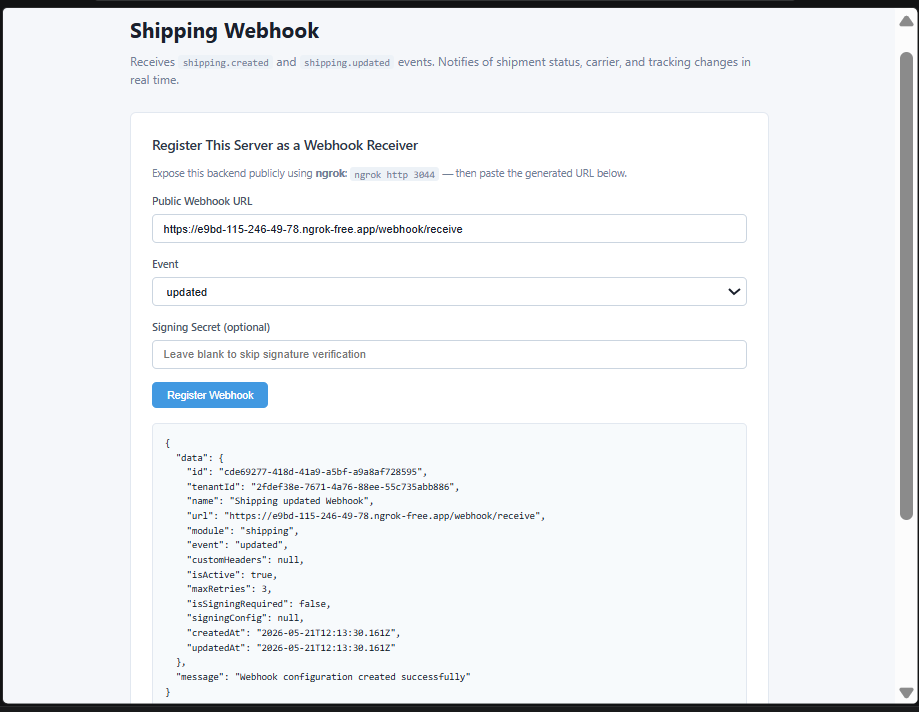

# Shipping Status Webhook

Receives **`shipping.updated`** events from Wizlo. Triggered when a shipment status changes (e.g. dispatched, in transit, delivered).

## What it does

When a shipping record is updated in Wizlo UAT, Wizlo sends a POST request to your registered webhook URL. This sample receives the event, logs the shipping number and status, and displays it in a live-updating frontend.

## Ports

| Service  | Port |
|----------|------|
| Backend  | 3044 |
| Frontend | 3054 |

## Setup

**1. Create the `.env` file in `backend/`:**
```
WIZLO_BASE_URL=https://api-uat.wizlo.com
WIZLO_CLIENT_ID=your_client_id
WIZLO_CLIENT_SECRET=your_client_secret
WEBHOOK_SECRET=
WEBHOOK_SIGNING_HEADER=x-webhook-signature
PORT=3044
```

**2. Install and run the backend:**
```bash
cd backend
npm install
npm run dev
```

**3. Install and run the frontend:**
```bash
cd frontend
npm install
npm run dev
```

**4. Start ngrok:**
```bash
ngrok http 3044
```

## Steps to test

1. Open `http://localhost:3054` in your browser
2. Paste your ngrok URL in the **Public Webhook URL** field:
   ```
   https://xxxx.ngrok-free.app/webhook/receive
   ```
3. Click **Register Webhook** — confirm success response
4. Log into Wizlo UAT and open any order that has a shipment
5. Update the shipping status (e.g. mark as dispatched or delivered)
6. The event appears in **Received Events** within 3 seconds

## Event payload example

```json
{
  "eventType": "updated",
  "shipping": {
    "shipping_no": "SH00000001",
    "shipping_status": "delivered"
  }
}
```

## Screenshots

**Webhook registered and event received:**


