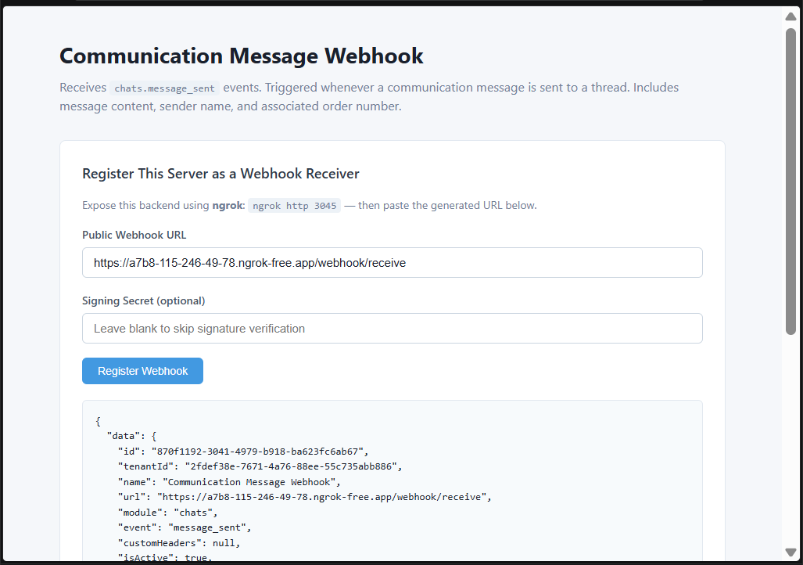

# Communication Message Webhook

Receives **`chats.message_sent`** events from Wizlo. Triggered when a message is sent in the Wizlo chat/communication module.

## What it does

When a clinician or patient sends a message through the Wizlo communication system, Wizlo fires a POST request to your registered webhook URL. This sample captures the event, showing the sender display name and associated order number.

## Ports

| Service  | Port |
|----------|------|
| Backend  | 3045 |
| Frontend | 3055 |

## Setup

**1. Create the `.env` file in `backend/`:**
```
WIZLO_BASE_URL=https://api-uat.wizlo.com
WIZLO_CLIENT_ID=your_client_id
WIZLO_CLIENT_SECRET=your_client_secret
WEBHOOK_SECRET=
WEBHOOK_SIGNING_HEADER=x-webhook-signature
PORT=3045
```

**2. Install and run the backend:**
```bash
cd backend
npm install
npm run dev
```

**3. Install and run the frontend:**
```bash
cd frontend
npm install
npm run dev
```

**4. Start ngrok:**
```bash
ngrok http 3045
```

## Steps to test

1. Open `http://localhost:3055` in your browser
2. Paste your ngrok URL in the **Public Webhook URL** field:
   ```
   https://xxxx.ngrok-free.app/webhook/receive
   ```
3. Click **Register Webhook** — confirm success response
4. Log into Wizlo UAT and open the communication/chat section
5. Send a message in any chat thread
6. The event appears in **Received Events** within 3 seconds

## Event payload example

```json
{
  "eventType": "message_sent",
  "senderDisplayName": "Dr. Smith",
  "orderNo": "ORD00000001",
  "message": "Your prescription is ready."
}
```

## Screenshots

**Webhook registered and event received:**


