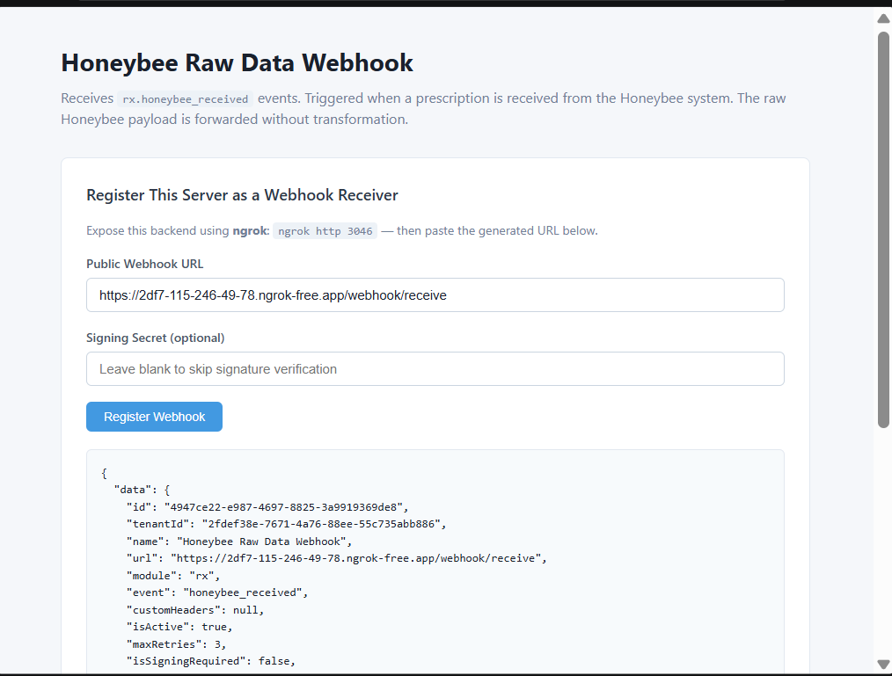

# Honeybee Raw Data Webhook

Receives **`rx.honeybee_received`** events from Wizlo. Triggered when raw prescription data is received from the Honeybee pharmacy integration.

## What it does

When Wizlo receives prescription (Rx) data from the Honeybee pharmacy system, it fires a webhook to your registered URL. This sample captures the event and logs the patient ID and drug names from the received medication requests.

## Ports

| Service  | Port |
|----------|------|
| Backend  | 3046 |
| Frontend | 3056 |

## Setup

**1. Create the `.env` file in `backend/`:**
```
WIZLO_BASE_URL=https://api-uat.wizlo.com
WIZLO_CLIENT_ID=your_client_id
WIZLO_CLIENT_SECRET=your_client_secret
WEBHOOK_SECRET=
WEBHOOK_SIGNING_HEADER=x-webhook-signature
PORT=3046
```

**2. Install and run the backend:**
```bash
cd backend
npm install
npm run dev
```

**3. Install and run the frontend:**
```bash
cd frontend
npm install
npm run dev
```

**4. Start ngrok:**
```bash
ngrok http 3046
```

## Steps to test

1. Open `http://localhost:3056` in your browser
2. Paste your ngrok URL in the **Public Webhook URL** field:
   ```
   https://xxxx.ngrok-free.app/webhook/receive
   ```
3. Click **Register Webhook** — confirm success response
4. Trigger a Honeybee pharmacy data sync in Wizlo UAT (process a prescription through the Honeybee integration)
5. The event appears in **Received Events** within 3 seconds

## Event payload example

```json
{
  "event_type": "RX_RECEIVED",
  "patient_id": "PAT00000001",
  "medication_requests": [
    { "drug_name": "Metformin 500mg" },
    { "drug_name": "Lisinopril 10mg" }
  ]
}
```

## Screenshots

**Webhook registered and event received:**


