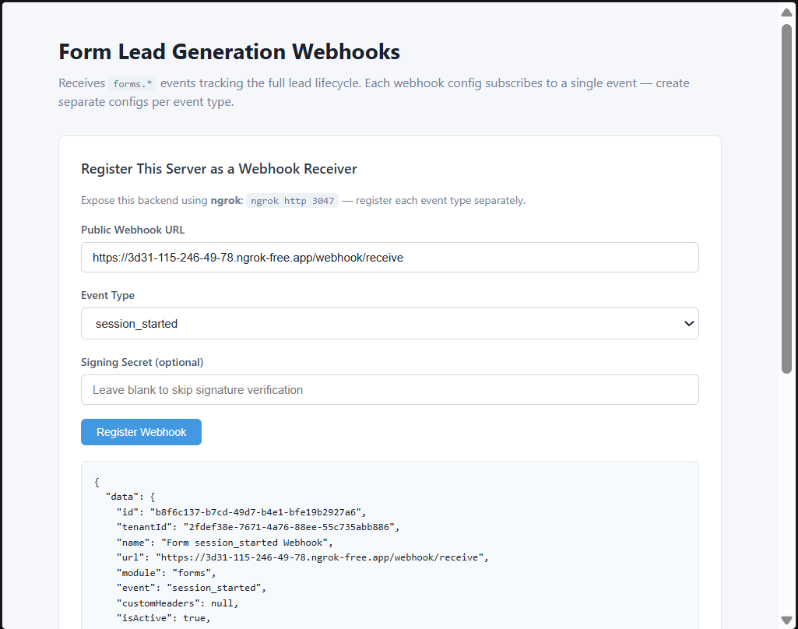

# Form Webhooks

Receives **`forms.*`** events from Wizlo. Triggered at every stage of a patient intake form session.

## What it does

When a patient interacts with a Wizlo intake form, events fire at each lifecycle stage. This sample lets you choose which event to subscribe to and displays received form events in a live frontend.

## Supported events

| Event | Triggered when |
|-------|---------------|
| `session_started` | Patient opens and starts the form |
| `progress_saved` | Patient saves progress mid-form |
| `completed` | Patient submits the completed form |
| `product_selected` | Patient selects a product during the form |
| `coupon_used` | Patient applies a coupon code |
| `disqualified` | Patient is disqualified based on form answers |
| `abandoned` | Patient exits without completing the form |

## Ports

| Service  | Port |
|----------|------|
| Backend  | 3047 |
| Frontend | 3057 |

## Setup

**1. Create the `.env` file in `backend/`:**
```
WIZLO_BASE_URL=https://api-uat.wizlo.com
WIZLO_CLIENT_ID=your_client_id
WIZLO_CLIENT_SECRET=your_client_secret
WEBHOOK_SECRET=
WEBHOOK_SIGNING_HEADER=x-webhook-signature
PORT=3047
```

**2. Install and run the backend:**
```bash
cd backend
npm install
npm run dev
```

**3. Install and run the frontend:**
```bash
cd frontend
npm install
npm run dev
```

**4. Start ngrok:**
```bash
ngrok http 3047
```

## Steps to test

1. Open `http://localhost:3057` in your browser
2. Select the form event you want to listen for (e.g. `session_started`)
3. Paste your ngrok URL in the **Public Webhook URL** field:
   ```
   https://xxxx.ngrok-free.app/webhook/receive
   ```
4. Click **Register Webhook** — confirm success response
5. Log into Wizlo UAT and start filling out a patient intake form
6. Perform the action matching your chosen event (start, save, submit, etc.)
7. The event appears in **Received Events** within 3 seconds

## Event payload example

```json
{
  "event": "forms.completed",
  "data": {
    "form_name": "GLP-1 Intake Form",
    "session_id": "sess_abc123",
    "completed_at": "2026-05-21T10:30:00.000Z"
  }
}
```

## Screenshots

**Webhook registered and event received:**


