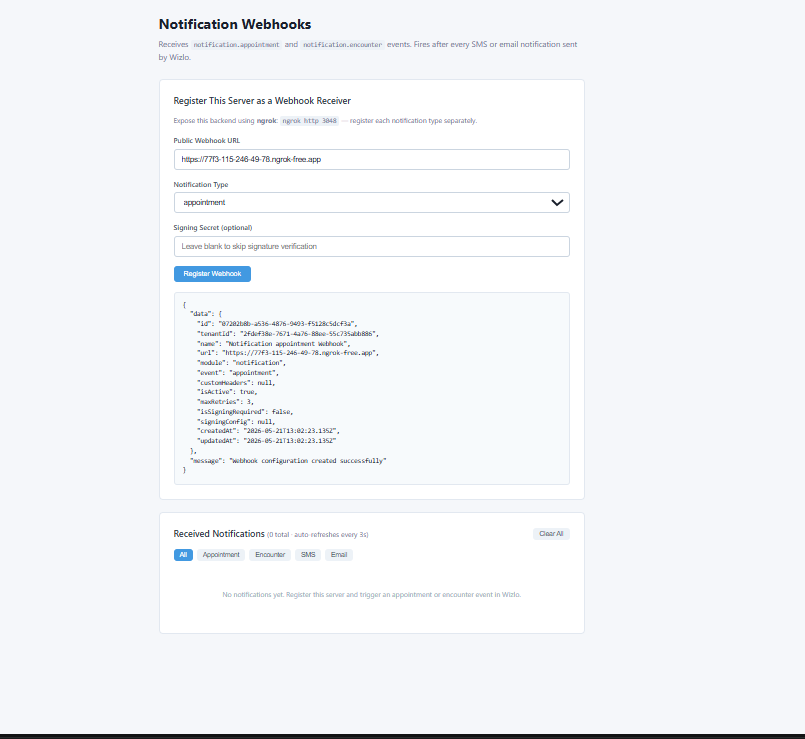

# Notification Webhooks

Receives **`notification.*`** events from Wizlo. Triggered when Wizlo sends a notification to a patient or clinician (email, SMS, push, etc.).

## What it does

When Wizlo dispatches a notification — such as an appointment reminder, order confirmation, or prescription ready alert — it fires a webhook to your registered URL. This sample captures the event and shows the notification channel, recipient, and type in a live frontend.

## Ports

| Service  | Port |
|----------|------|
| Backend  | 3048 |
| Frontend | 3058 |

## Setup

**1. Create the `.env` file in `backend/`:**
```
WIZLO_BASE_URL=https://api-uat.wizlo.com
WIZLO_CLIENT_ID=your_client_id
WIZLO_CLIENT_SECRET=your_client_secret
WEBHOOK_SECRET=
WEBHOOK_SIGNING_HEADER=x-webhook-signature
PORT=3048
```

**2. Install and run the backend:**
```bash
cd backend
npm install
npm run dev
```

**3. Install and run the frontend:**
```bash
cd frontend
npm install
npm run dev
```

**4. Start ngrok:**
```bash
ngrok http 3048
```

## Steps to test

1. Open `http://localhost:3058` in your browser
2. Select the notification event type (e.g. `appointment`)
3. Paste your ngrok URL in the **Public Webhook URL** field:
   ```
   https://xxxx.ngrok-free.app/webhook/receive
   ```
4. Click **Register Webhook** — confirm success response
5. Log into Wizlo UAT and trigger a notification:
   - Book or update an appointment
   - Complete an order
   - Send a prescription ready notification
6. The event appears in **Received Events** within 3 seconds

## Event payload example

```json
{
  "event": "appointment",
  "module": "notification",
  "channel": "email",
  "recipient": "patient@example.com",
  "sentAt": "2026-05-21T10:30:00.000Z"
}
```

## Screenshots

**Webhook registered and event received:**


